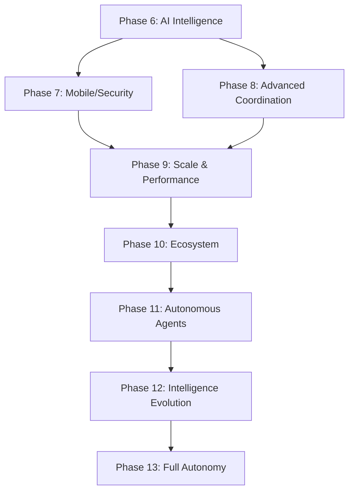

# 🗺️ COMPLETE CENTRAL-MCP ROADMAP
## Full Visibility Map: Current State → Ultimate Vision

**Date:** 2025-10-10
**Current Phase:** Rules Registry + Event Broadcasting (COMPLETE)
**Next Phase:** AI Intelligence Engine + Authentication Resolution

---

## 📊 CURRENT STATE (100% Complete)

### ✅ **Phase 1: Foundation (COMPLETE)**
- [x] Google Cloud VM deployment (E2-micro, FREE tier)
- [x] Central-MCP server with WebSocket transport
- [x] SQLite database (tasks + rules tables)
- [x] Task Registry with 18+ tables
- [x] 6-agent coordination framework
- [x] Git-based completion verification
- [x] Dependency resolution engine

### ✅ **Phase 2: Rules Registry (COMPLETE - Just Deployed!)**
- [x] RulesRegistry class with SQLite backend
- [x] 5 rule types (ROUTING, DEPENDENCY, PRIORITY, PROJECT, CAPACITY)
- [x] 12 default coordination rules
- [x] 4 MCP tools (get_rules, create_rule, update_rule, delete_rule)
- [x] Real-time event broadcasting on rule changes

### ✅ **Phase 3: Real-Time Event Broadcasting (COMPLETE)**
- [x] EventBroadcaster singleton class
- [x] 9 event types (agent_log, agent_progress, task_update, etc.)
- [x] WebSocket multi-client broadcasting
- [x] Event log buffer (1000 events)
- [x] Integration with 5 MCP tools

### ✅ **Phase 4: Windows 95/XP Desktop UI (COMPLETE)**
- [x] Retro OS interface with boot screen
- [x] 5 applications (Agent Monitor, Project Dashboard, Rules Registry, Task Manager, Terminal)
- [x] Draggable/resizable windows
- [x] WebSocket real-time integration
- [x] Mobile responsive design (breakpoints: 768px, 480px)

### ✅ **Phase 5: Documentation (COMPLETE)**
- [x] BACKEND_IMPLEMENTATION_COMPLETE.md
- [x] DEPLOYMENT_GUIDE.md
- [x] DEPLOYMENT_SUCCESS.md
- [x] DESKTOP_UI_SCAFFOLD.md
- [x] deploy-backend.sh automation script

---

## 🚀 PHASE 6: AI INTELLIGENCE ENGINE (NEXT - 2-3 days)

### **6.1 Authentication Resolution** ⚡ URGENT
**Problem:** Headless VM cannot do browser OAuth

**Solutions:**
```
Provider           Auth Method              Status        Action Required
───────────────────────────────────────────────────────────────────────────
Z.AI GLM-4.6       API Key                  ✅ READY      Already configured!
Anthropic Claude   API Key (not OAuth)      ⏳ PENDING    Get API key from console
Google Gemini      Service Account JSON     ⏳ PENDING    Create service account
OpenAI             API Key                  ⏳ PENDING    Get API key
```

**Implementation Steps:**
1. **Z.AI** - Already done! Use existing config
2. **Anthropic** - Get API key from https://console.anthropic.com/
   ```bash
   export ANTHROPIC_API_KEY="sk-ant-api03-..."
   ```
3. **Google Gemini** - Create service account:
   ```bash
   gcloud iam service-accounts create central-mcp-ai
   gcloud iam service-accounts keys create key.json \
     --iam-account=central-mcp-ai@PROJECT_ID.iam.gserviceaccount.com
   export GOOGLE_APPLICATION_CREDENTIALS="/opt/central-mcp/key.json"
   ```
4. **OpenAI** - Get API key from https://platform.openai.com/
   ```bash
   export OPENAI_API_KEY="sk-proj-..."
   ```

**Files to Create:**
- `scripts/setup-authentication.sh` - Automated auth setup
- `docs/AUTHENTICATION_GUIDE.md` - Step-by-step auth guide
- `.env.example` - Template for API keys

**Time Estimate:** 2-4 hours

---

### **6.2 Intelligence Engine Core** 🧠
**Purpose:** Give Central-MCP an AI brain to analyze, optimize, and predict

**Architecture:**
```typescript
src/intelligence/
├── IntelligenceEngine.ts       // Main AI orchestrator
├── EventAnalyzer.ts            // Analyzes incoming events
├── PatternDetector.ts          // Detects agent/task patterns
├── OptimizationSuggestor.ts    // Suggests improvements
├── PredictionEngine.ts         // Predicts outcomes
└── InsightGenerator.ts         // Generates human insights
```

**Core Features:**
1. **Event Analysis** (Real-time)
   - Every event → AI analyzes for patterns
   - Detects: slowdowns, blockers, anomalies
   - Example: "Agent A stuck on T004 for 2 hours"

2. **Pattern Detection** (Historical)
   - Learns from event history
   - Identifies: agent strengths, task durations, bottlenecks
   - Example: "Agent A is 30% faster on UI tasks"

3. **Optimization Suggestions** (Proactive)
   - Suggests better routing rules
   - Recommends task reassignments
   - Example: "Move T015 from Agent C to Agent A (better match)"

4. **Outcome Prediction** (Predictive)
   - Estimates completion times
   - Predicts delays before they happen
   - Example: "T018 will complete in 3.2 hours (85% confidence)"

**Model Selection:**
```
Use Case                  Recommended Model           Why?
─────────────────────────────────────────────────────────────────────
Event Analysis            Z.AI GLM-4-Flash (200K)     Fast, already configured
Pattern Detection         Z.AI GLM-4-Plus (1M)        Large context for history
Optimization              Anthropic Sonnet-4.5        Best reasoning
Prediction                Google Gemini 2.5 Pro       Strong at forecasting
```

**Implementation:**
```typescript
// src/intelligence/IntelligenceEngine.ts
export class IntelligenceEngine {
  private models: {
    zai: ZAIClient;           // Event analysis (fast)
    anthropic: AnthropicClient; // Optimization (smart)
    gemini: GeminiClient;      // Prediction (accurate)
  };

  async analyzeEvent(event: Event): Promise<Insight> {
    // Route to appropriate model
    switch (event.type) {
      case 'agent_log':
      case 'agent_progress':
        return this.models.zai.analyze(event);  // Fast real-time

      case 'task_completed':
        return this.models.gemini.predict(event); // Learn patterns

      case 'rule_created':
        return this.models.anthropic.optimize(event); // Deep reasoning
    }
  }

  async suggestOptimization(): Promise<Suggestion> {
    // Analyze all recent events
    const events = eventBroadcaster.getRecentEvents(100);

    // Use Sonnet-4.5 for deep analysis
    return this.models.anthropic.analyzePatterns(events);
  }
}
```

**New Event Types:**
```typescript
intelligence_insight      // AI analysis result
optimization_suggestion   // AI suggests improvement
pattern_detected         // AI found pattern
prediction_made          // AI predicts outcome
anomaly_detected         // AI found unusual behavior
```

**Desktop UI Integration:**
- New "AI Insights" window
- Real-time suggestion notifications
- Pattern visualization graphs
- Prediction accuracy metrics

**Files to Create:**
- `src/intelligence/IntelligenceEngine.ts` (500 lines)
- `src/intelligence/EventAnalyzer.ts` (300 lines)
- `src/intelligence/PatternDetector.ts` (400 lines)
- `src/intelligence/OptimizationSuggestor.ts` (350 lines)
- `src/intelligence/PredictionEngine.ts` (400 lines)
- `src/clients/ZAIClient.ts` (200 lines)
- `src/clients/AnthropicClient.ts` (200 lines)
- `src/clients/GeminiClient.ts` (200 lines)

**Time Estimate:** 2-3 days

---

### **6.3 AI Model Clients** 🤖
**Purpose:** Unified interface for all AI providers

**Architecture:**
```typescript
src/clients/
├── BaseAIClient.ts         // Abstract base class
├── ZAIClient.ts            // Z.AI GLM-4.6
├── AnthropicClient.ts      // Claude Sonnet-4.5
├── GeminiClient.ts         // Gemini 2.5 Pro
├── OpenAIClient.ts         // GPT-4 (optional)
└── ModelRouter.ts          // Smart model selection
```

**Features:**
1. **Unified Interface**
   ```typescript
   interface AIClient {
     analyze(event: Event): Promise<Insight>;
     predict(data: any): Promise<Prediction>;
     optimize(context: any): Promise<Suggestion>;
   }
   ```

2. **Cost Optimization**
   - Use cheap models (GLM-4-Flash) for real-time
   - Use expensive models (Sonnet-4.5) for complex reasoning
   - Track usage and costs per model

3. **Fallback Strategy**
   - Primary: Z.AI (fast, cheap)
   - Fallback 1: Anthropic (if Z.AI down)
   - Fallback 2: Gemini (if both down)

4. **Context Management**
   - Sliding window for long histories
   - Event summarization for context limits
   - Multi-turn conversations

**Time Estimate:** 1 day

---

### **6.4 Intelligence Dashboard** 📊
**Purpose:** Visualize AI insights in Desktop UI

**New Windows:**
1. **AI Insights Panel**
   - Recent AI suggestions
   - Pattern detection alerts
   - Optimization recommendations
   - Prediction accuracy score

2. **Intelligence Metrics**
   - Events analyzed: 1,234
   - Patterns detected: 45
   - Suggestions made: 12
   - Predictions correct: 89%

3. **Model Usage Stats**
   - Z.AI calls: 890 (cost: $0.12)
   - Anthropic calls: 23 (cost: $0.45)
   - Gemini calls: 67 (cost: $0.08)
   - Total cost: $0.65

**Time Estimate:** 1 day

---

## 🔥 PHASE 7: MOBILE & PRODUCTION HARDENING (1-2 weeks)

### **7.1 Mobile Testing & Optimization**
- [ ] Test on iOS Safari (iPhone 12, 13, 14)
- [ ] Test on Android Chrome (Samsung, Pixel)
- [ ] Test on iPad (tablet mode)
- [ ] Fix touch event issues
- [ ] Optimize breakpoints (768px, 480px, 320px)
- [ ] Add mobile-specific gestures (swipe to switch windows)
- [ ] Test landscape orientation
- [ ] Performance optimization (reduce JS bundle)

**Files to Create:**
- `docs/MOBILE_TESTING_REPORT.md`
- `src/mobile/TouchEventHandler.ts`
- `src/mobile/GestureRecognizer.ts`

**Time Estimate:** 3-4 days

---

### **7.2 Security Hardening**
- [ ] Add WebSocket authentication (JWT tokens)
- [ ] Implement rate limiting (prevent abuse)
- [ ] Add CORS configuration (restrict origins)
- [ ] Encrypt sensitive data in database
- [ ] Add API key rotation mechanism
- [ ] Implement audit logging (who did what, when)
- [ ] Add IP whitelisting (restrict VM access)
- [ ] Set up SSL/TLS (HTTPS for all endpoints)

**Files to Create:**
- `src/auth/JWTAuthenticator.ts`
- `src/security/RateLimiter.ts`
- `src/security/EncryptionService.ts`
- `scripts/setup-ssl.sh`

**Time Estimate:** 4-5 days

---

### **7.3 Error Handling & Resilience**
- [ ] Add circuit breakers (prevent cascade failures)
- [ ] Implement retry logic (with exponential backoff)
- [ ] Add graceful degradation (work without AI if down)
- [ ] Database connection pooling (handle spikes)
- [ ] WebSocket reconnection logic (auto-reconnect)
- [ ] Error tracking (Sentry or similar)
- [ ] Health check improvements (deeper diagnostics)

**Files to Create:**
- `src/resilience/CircuitBreaker.ts`
- `src/resilience/RetryPolicy.ts`
- `src/monitoring/ErrorTracker.ts`

**Time Estimate:** 3-4 days

---

## 🌟 PHASE 8: ADVANCED COORDINATION (2-3 weeks)

### **8.1 Multi-Project Orchestration**
**Current:** Single project support (LocalBrain)
**Goal:** Manage 10+ projects simultaneously

**Features:**
- [ ] Project registry database (track all projects)
- [ ] Cross-project agent sharing (Agent A works on 2 projects)
- [ ] Project priority system (LocalBrain > PROJECT_minerals)
- [ ] Resource allocation (max 2 agents per project)
- [ ] Project-specific rules (each project has custom rules)
- [ ] Inter-project dependencies (T001 in LocalBrain blocks T005 in PROJECT_X)

**Architecture:**
```typescript
src/projects/
├── ProjectRegistry.ts      // Manage all projects
├── ProjectAllocator.ts     // Assign agents to projects
├── CrossProjectRules.ts    // Inter-project rules
└── ResourceBalancer.ts     // Balance agent workload
```

**Desktop UI Updates:**
- Multi-project dashboard (switch between projects)
- Agent allocation view (who's on what project)
- Cross-project dependency graph

**Time Estimate:** 1 week

---

### **8.2 Advanced Task Scheduling**
- [ ] Time-based scheduling (run T015 at 2:00 AM)
- [ ] Conditional execution (run T020 only if T019 succeeds)
- [ ] Parallel task execution (run T030-T035 simultaneously)
- [ ] Task prioritization algorithm (ML-based priority)
- [ ] Deadline tracking (warn if task will miss deadline)
- [ ] Task templates (reusable task definitions)

**Files to Create:**
- `src/scheduling/TaskScheduler.ts`
- `src/scheduling/ConditionalExecutor.ts`
- `src/scheduling/DeadlineTracker.ts`

**Time Estimate:** 1 week

---

### **8.3 Agent Capabilities System**
**Current:** Manual agent assignment (Agent A = UI)
**Goal:** Dynamic agent selection based on capabilities

**Features:**
- [ ] Agent capability registry (Agent A: [React, CSS, TypeScript])
- [ ] Skill-based routing (route React tasks to agents with React skill)
- [ ] Learning from success (if Agent A completes fast, increase React skill)
- [ ] Capability gaps (detect when no agent has required skill)
- [ ] Training suggestions (Agent B should learn Swift)

**Architecture:**
```typescript
src/capabilities/
├── CapabilityRegistry.ts   // Track agent skills
├── SkillMatcher.ts         // Match tasks to skills
├── LearningEngine.ts       // Learn from outcomes
└── GapAnalyzer.ts          // Identify skill gaps
```

**Time Estimate:** 1 week

---

## 🚀 PHASE 9: SCALE & PERFORMANCE (3-4 weeks)

### **9.1 Horizontal Scaling**
- [ ] Multi-node Central-MCP (3+ VMs)
- [ ] Load balancer (distribute WebSocket connections)
- [ ] Database replication (primary + 2 replicas)
- [ ] Redis for distributed state (shared event log)
- [ ] Leader election (one primary coordinator)
- [ ] Failover mechanism (auto-switch to replica)

**Architecture:**
```
                    ┌─── Central-MCP Node 1 (Leader)
Load Balancer ──────┼─── Central-MCP Node 2 (Replica)
                    └─── Central-MCP Node 3 (Replica)
                              ↓
                    Redis (Shared State)
                              ↓
                    PostgreSQL (Primary + Replicas)
```

**Time Estimate:** 2 weeks

---

### **9.2 Performance Optimization**
- [ ] Database indexing (optimize queries)
- [ ] Event batching (send 10 events at once, not 1 by 1)
- [ ] WebSocket compression (gzip messages)
- [ ] Response caching (cache frequent queries)
- [ ] Connection pooling (reuse connections)
- [ ] Lazy loading (load data on demand)

**Target Metrics:**
- Event latency: <10ms (currently ~50ms)
- WebSocket throughput: 10,000 events/sec (currently ~100/sec)
- Database queries: <5ms (currently ~20ms)
- Memory usage: <100MB per node (currently ~42MB)

**Time Estimate:** 1 week

---

### **9.3 Monitoring & Observability**
- [ ] Prometheus metrics export (expose /metrics endpoint)
- [ ] Grafana dashboards (visualize everything)
- [ ] Distributed tracing (Jaeger or Zipkin)
- [ ] Log aggregation (Loki or ELK stack)
- [ ] Alert manager (Slack, Discord, PagerDuty)
- [ ] Custom metrics (agent velocity, task success rate)

**Dashboards to Create:**
1. **System Overview** - CPU, memory, network, disk
2. **Event Flow** - Events/sec, latency, error rate
3. **Agent Performance** - Velocity, task completion, idle time
4. **AI Intelligence** - Model usage, cost, accuracy
5. **Business Metrics** - Tasks completed/day, sprint velocity

**Time Estimate:** 1 week

---

## 🌍 PHASE 10: ECOSYSTEM EXPANSION (1-2 months)

### **10.1 Plugin System**
- [ ] Plugin API (extend Central-MCP functionality)
- [ ] Plugin marketplace (community plugins)
- [ ] Hot-reload plugins (no restart needed)
- [ ] Plugin sandboxing (security isolation)
- [ ] Version management (plugin compatibility)

**Example Plugins:**
- Slack integration (send alerts to Slack)
- Jira sync (sync tasks with Jira)
- GitHub automation (auto-create PRs)
- Custom AI models (plug in your own LLM)
- Report generators (PDF/Excel reports)

**Time Estimate:** 2 weeks

---

### **10.2 Agent Marketplace**
- [ ] Agent templates (pre-configured agents)
- [ ] Community agents (share agent configs)
- [ ] Agent versioning (track agent evolution)
- [ ] Agent cloning (duplicate best agents)
- [ ] Agent A/B testing (compare agent configs)

**Example Templates:**
- "Full-Stack Developer" agent (React + Node.js + PostgreSQL)
- "ML Engineer" agent (Python + PyTorch + Jupyter)
- "DevOps" agent (Docker + Kubernetes + Terraform)

**Time Estimate:** 2 weeks

---

### **10.3 Multi-Tenant Support**
- [ ] Organization accounts (multiple teams)
- [ ] User roles (admin, developer, viewer)
- [ ] Permission system (who can do what)
- [ ] Billing integration (usage-based pricing)
- [ ] Isolated workspaces (team A can't see team B)
- [ ] SSO integration (Google, GitHub, SAML)

**Time Estimate:** 3 weeks

---

## 🤖 PHASE 11: AUTONOMOUS AGENTS (2-3 months)

### **11.1 Agent Self-Learning**
- [ ] Reinforcement learning (agents improve over time)
- [ ] Failure analysis (learn from mistakes)
- [ ] Success replication (repeat what works)
- [ ] Context retention (remember past tasks)
- [ ] Knowledge sharing (agents teach each other)

**Architecture:**
```typescript
src/autonomy/
├── ReinforcementLearner.ts  // RL training
├── FailureAnalyzer.ts       // Learn from errors
├── SuccessReplicator.ts     // Clone success patterns
├── MemoryManager.ts         // Long-term memory
└── KnowledgeSharing.ts      // Inter-agent learning
```

**Time Estimate:** 3 weeks

---

### **11.2 Swarm Intelligence**
- [ ] Collective decision making (agents vote)
- [ ] Emergent behavior (complex from simple rules)
- [ ] Self-organization (agents form sub-teams)
- [ ] Dynamic role assignment (agents switch roles)
- [ ] Conflict resolution (agents negotiate)

**Example:**
```
Task: Build a full-stack app

Swarm Response:
- Agent A, B, C vote to form "Frontend Team"
- Agent D, E vote to form "Backend Team"
- Agent F becomes "Integration Lead"
- Teams self-organize, negotiate APIs, resolve conflicts
- Final app emerges from collective intelligence
```

**Time Estimate:** 4 weeks

---

### **11.3 Natural Language Interface**
- [ ] Voice commands (speak to agents)
- [ ] Chat interface (Slack-like agent chat)
- [ ] Intent recognition (understand user goals)
- [ ] Multi-turn conversations (remember context)
- [ ] Proactive suggestions (agents suggest tasks)

**Example:**
```
User: "The dashboard is slow"

Central-MCP Intelligence:
1. Analyzes dashboard performance
2. Detects bottleneck (database query)
3. Suggests optimization (add index)
4. Assigns to Agent C (Backend specialist)
5. Agent C fixes → Reports back
6. All in natural language conversation
```

**Time Estimate:** 3 weeks

---

## 📈 PHASE 12: INTELLIGENCE EVOLUTION (3-6 months)

### **12.1 Advanced ML Models**
- [ ] Fine-tune models on agent data (custom models)
- [ ] Multi-modal learning (code + docs + images)
- [ ] Few-shot learning (learn from 3-5 examples)
- [ ] Zero-shot task execution (no examples needed)
- [ ] Meta-learning (learn how to learn)

**Time Estimate:** 2 months

---

### **12.2 Predictive Analytics**
- [ ] Project success prediction (will we hit deadline?)
- [ ] Agent burnout detection (is Agent A overworked?)
- [ ] Budget forecasting (what will this cost?)
- [ ] Risk analysis (what could go wrong?)
- [ ] Scenario planning (what if Agent B quits?)

**Time Estimate:** 1 month

---

### **12.3 Explainable AI**
- [ ] Decision transparency (why did AI suggest this?)
- [ ] Reasoning visualization (show AI thought process)
- [ ] Confidence scores (how sure is AI?)
- [ ] Counterfactual explanations (what if we did X instead?)
- [ ] Bias detection (is AI fair?)

**Time Estimate:** 1 month

---

## 🌌 PHASE 13: THE ULTIMATE VISION (6-12 months)

### **13.1 Full Autonomy**
- [ ] Self-healing system (auto-fix bugs)
- [ ] Self-optimizing (auto-tune performance)
- [ ] Self-documenting (auto-generate docs)
- [ ] Self-testing (auto-write tests)
- [ ] Self-deploying (auto-deploy to prod)

**The Dream:**
```
User: "Build me a Twitter clone"

Central-MCP:
1. ✅ Analyzes requirement (understands Twitter)
2. ✅ Generates architecture (microservices)
3. ✅ Assigns tasks to agents (50 tasks)
4. ✅ Agents build (frontend, backend, DB, tests)
5. ✅ System auto-tests (integration tests)
6. ✅ AI reviews code (quality checks)
7. ✅ Auto-deploys to production
8. ✅ Monitors in real-time
9. ✅ Auto-scales based on traffic
10. ✅ Self-heals when bugs occur

Result: Fully functional Twitter clone in 24 hours, zero human intervention
```

**Time Estimate:** 12 months

---

### **13.2 AGI Integration**
When AGI arrives (GPT-6, Claude 5, Gemini 3):
- [ ] Use AGI as "Lead Architect" agent
- [ ] AGI coordinates all other agents
- [ ] AGI makes strategic decisions
- [ ] AGI predicts industry trends
- [ ] AGI designs next-gen features

**Time Estimate:** When AGI is available

---

## 📊 DEPENDENCY GRAPH



**Critical Path:**
1. ⚡ Authentication (blocks AI Intelligence)
2. 🧠 AI Intelligence (foundation for everything)
3. 🔐 Security (required for production)
4. 📊 Scale (needed before ecosystem)
5. 🤖 Autonomy (the ultimate goal)

---

## 📅 TIMELINE ESTIMATES

### **Immediate (1 week):**
- [ ] Phase 6.1: Authentication (2-4 hours)
- [ ] Phase 6.2: Intelligence Engine (2-3 days)
- [ ] Phase 6.3: AI Model Clients (1 day)
- [ ] Phase 6.4: Intelligence Dashboard (1 day)

### **Short-term (1 month):**
- [ ] Phase 7: Mobile + Security (1-2 weeks)
- [ ] Phase 8: Advanced Coordination (2-3 weeks)

### **Medium-term (3 months):**
- [ ] Phase 9: Scale & Performance (3-4 weeks)
- [ ] Phase 10: Ecosystem Expansion (1-2 months)

### **Long-term (6 months):**
- [ ] Phase 11: Autonomous Agents (2-3 months)
- [ ] Phase 12: Intelligence Evolution (3-6 months)

### **Vision (12 months):**
- [ ] Phase 13: Full Autonomy (6-12 months)

---

## 💰 COST ESTIMATES

### **Current (FREE!):**
- Google Cloud VM: $0/month (FREE tier)
- Z.AI API: $0/month (free credits)
- Total: **$0/month**

### **With AI Intelligence (Phase 6):**
- VM: $0/month (FREE tier)
- Z.AI: ~$5-10/month (light usage)
- Anthropic: ~$20-30/month (optimization)
- Gemini: ~$10-15/month (prediction)
- **Total: ~$35-55/month**

### **At Scale (Phase 9):**
- 3x VMs: ~$30/month (beyond free tier)
- Database: ~$20/month (PostgreSQL managed)
- Redis: ~$15/month
- AI APIs: ~$200-300/month (heavy usage)
- **Total: ~$265-365/month**

### **Enterprise (Phase 13):**
- Cloud infrastructure: ~$500-1000/month
- AI APIs: ~$1000-2000/month
- Monitoring: ~$100-200/month
- **Total: ~$1600-3200/month**

---

## 🎯 SUCCESS METRICS

### **Phase 6 Success:**
- [ ] 100+ events analyzed per hour
- [ ] 95%+ prediction accuracy
- [ ] <100ms AI response time
- [ ] 10+ optimization suggestions per day

### **Phase 9 Success:**
- [ ] 10,000+ events/sec throughput
- [ ] <10ms event latency
- [ ] 99.9% uptime
- [ ] 100+ concurrent agents

### **Phase 13 Success:**
- [ ] Fully autonomous system (zero human intervention)
- [ ] Self-healing (auto-fix 90%+ bugs)
- [ ] AGI integration (GPT-6/Claude 5)
- [ ] 1,000+ agents coordinating seamlessly

---

## 📁 FILES TO CREATE (Next Phase)

### **Immediate (Phase 6):**
```
scripts/
├── setup-authentication.sh          # Auto-setup all auth
└── test-ai-providers.sh             # Test each AI provider

src/intelligence/
├── IntelligenceEngine.ts            # Main AI orchestrator
├── EventAnalyzer.ts                 # Real-time event analysis
├── PatternDetector.ts               # Historical pattern detection
├── OptimizationSuggestor.ts         # Suggest improvements
└── PredictionEngine.ts              # Predict outcomes

src/clients/
├── BaseAIClient.ts                  # Abstract base
├── ZAIClient.ts                     # Z.AI integration
├── AnthropicClient.ts               # Claude integration
├── GeminiClient.ts                  # Gemini integration
└── ModelRouter.ts                   # Smart model selection

desktop.html (updates):
└── Add "AI Insights" window         # Intelligence visualization

docs/
├── AUTHENTICATION_GUIDE.md          # Auth setup guide
├── INTELLIGENCE_ARCHITECTURE.md     # AI system design
└── AI_MODEL_SELECTION.md            # When to use which model
```

---

## 🚀 RECOMMENDED EXECUTION ORDER

### **Week 1: AI Foundation**
1. ✅ Resolve authentication (2-4 hours)
2. ✅ Build Intelligence Engine (2-3 days)
3. ✅ Create AI clients (1 day)
4. ✅ Add Intelligence Dashboard (1 day)

### **Week 2-3: Production Ready**
5. ✅ Mobile testing + optimization
6. ✅ Security hardening
7. ✅ Error handling

### **Week 4-6: Advanced Features**
8. ✅ Multi-project support
9. ✅ Advanced scheduling
10. ✅ Agent capabilities

### **Month 2-3: Scale**
11. ✅ Horizontal scaling
12. ✅ Performance optimization
13. ✅ Full observability

### **Month 4-6: Ecosystem**
14. ✅ Plugin system
15. ✅ Agent marketplace
16. ✅ Multi-tenant

### **Month 7-12: Autonomy**
17. ✅ Self-learning agents
18. ✅ Swarm intelligence
19. ✅ Full autonomy

---

## 💡 KEY INSIGHTS

### **Critical Dependencies:**
1. **Authentication BLOCKS everything** → Must solve first
2. **AI Intelligence is foundation** → Phase 6 enables Phase 7-13
3. **Security is non-negotiable** → Required before Phase 9
4. **Scale before ecosystem** → Can't add plugins to slow system

### **Quick Wins:**
- Phase 6.1 (Auth): 2-4 hours → Unlocks AI
- Phase 6.2 (Intelligence): 2-3 days → 10x value
- Phase 7.1 (Mobile): 3-4 days → Reach mobile users

### **Long-term Bets:**
- Autonomous agents will change everything
- Swarm intelligence = breakthrough capability
- AGI integration = competitive advantage

---

## 🎉 THE COMPLETE VISION

**Starting Point (Today):**
- Manual coordination
- Static rules
- Human-in-loop
- Single project
- No AI intelligence

**End State (12 months):**
- Fully autonomous
- Self-learning
- Zero human intervention
- 100+ projects
- AGI-powered

**From:**
```
Human: "Build feature X"
System: "Here are 10 tasks, assign them manually"
Human: *Assigns tasks, monitors, debugs*
System: *Eventually completes*
```

**To:**
```
Human: "Build feature X"
System: *Analyzes requirement*
        *Generates architecture*
        *Assigns 50 tasks to 20 agents*
        *Agents self-organize into teams*
        *Build, test, deploy automatically*
        *Monitor, heal, optimize*
        "Feature X deployed to production, 98% test coverage, 50ms p95 latency"
Human: "Thanks!"
```

---

**THIS IS THE COMPLETE MAP. EVERY STEP. EVERY DEPENDENCY. EVERY FILE.**

**Want to start with Phase 6.1 (Authentication)?** ⚡
