# 🌍 ECOSYSTEM DIGITAL ARCHITECTURE

**Generated:** 2025-10-14 22:25
**Scope:** Complete digital ecosystem mapping
**Framework:** Mermaid Dark Theme v5.5
**User Node:** Nó 0 (Central Control Point)

---

## 🎯 **ECOSYSTEM MAP - MERMAID ARCHITECTURE**

```mermaid
%%{init: {'theme': 'dark', 'themeVariables': { 'primaryColor': '#fff', 'primaryTextColor': '#fff', 'primaryBorderColor': '#fff', 'lineColor': '#fff', 'sectionBkgColor': '#1e1e1e', 'altSectionBkgColor': '#2a2a2a', 'gridColor': '#333', 'textColor': '#fff', 'labelTextColor': '#ccc'}}}%%
graph TD
    %% USER CENTRAL NODE
    User["👤 USER<br/>Nó 0<br/>Control Point"]

    %% CORE CENTRAL MCP SYSTEMS
    MacBook["💻 MacBook Pro<br/>Development<br/>926GB SSD<br/>Local Environment"]
    GCP_VM["☁️ GCP VM<br/>central-mcp-server<br/>e2-standard-4<br/>us-central1-a"]
    GitHub["🐙 GitHub<br/>leolech14/PROJECT_central-mcp<br/>Version Control<br/>CI/CD Pipeline"]

    %% PROJECTS_ALL ECOSYSTEM
    ProjectsAll["📁 PROJECTS_all<br/>142 Projects<br/>Cross-Reference<br/>Resource Pool"]

    %% CLOUD STORAGE PROVIDERS
    GoogleStorage["🗂️ Google Cloud<br/>Drive<br/>Photos<br/>Gmail<br/>Workspace"]
    AppleStorage["🍎 Apple iCloud<br/>Photos<br/>Drive<br/>Keychain<br/>Messages"]

    %% AI & CLOUD SERVICES
    Doppler["🔐 Doppler<br/>Secrets Management<br/>v3.75.1<br/>Enterprise"]
    Anthropic["🤖 Anthropic Claude<br/>AI Platform<br/>Rate Limited<br/>Context Window"]
    OpenAI["🧠 OpenAI API<br/>GPT Models<br/>Rate Limited<br/>API Key"]
    RunPod["⚡ RunPod<br/>GPU Computing<br/>ProfilePro<br/>ComfyUI"]

    %% HARDWARE EXTERNAL
    ExternalHD["💾 External Storage<br/>USB Drives<br/>Backup Systems<br/>Archive Media"]

    %% DEVELOPMENT TOOLS
    ClaudeCode["💻 Claude Code CLI<br/>Development<br/>Local LLM<br/>File Analysis"]
    GeminiCLI["🎯 Gemini CLI<br/>1M Context<br/>Advanced Analysis<br/>Code Discovery"]

    %% COMMUNICATION PROTOCOLS
    SSH_Tunnel["🔒 SSH Tunneling<br/>VM Access<br/>Secure Shell<br/>Key-based Auth"]
    MCP_Protocol["🔌 MCP Protocol<br/>Agent Communication<br/>WebSocket<br/>Real-time Sync"]
    HTTP_API["🌐 HTTP/HTTPS<br/>REST APIs<br/>JSON Communication<br/>State Management"]

    %% DATA STORAGE
    SQLite_DB["🗄️ SQLite Databases<br/>registry.db<br/>file_analysis_cache.db<br/>Local Storage"]
    Git_Repo["📋 Git Repository<br/>Version Control<br/>History Tracking<br/>Branch Management"]

    %% PLACEHOLDER CATEGORIES
    FinanceApps["💰 Finance & Banking<br/>Investment Apps<br/>Budget Tools<br/>Transaction Data"]
    SocialMedia["📱 Social Networks<br/>Communication<br/>Content Sharing<br/>User Accounts"]
    Entertainment["🎮 Entertainment<br/>Streaming<br/>Gaming<br/>Media Libraries"]
    WorkApps["🏢 Work Applications<br/>Productivity<br/>Collaboration<br/>Professional Tools"]
    HealthApps["🏥 Health & Wellness<br/>Medical Records<br/>Fitness Apps<br/>Health Data"]
    IoT_Devices["📶 IoT Devices<br/>Smart Home<br/>Sensors<br/>Connected Objects"]

    %% CONNECTIONS - USER TO SYSTEMS
    User --> MacBook["🔄 Development<br/>Direct Access"]
    User --> ClaudeCode["🤖 AI Assistance<br/>Local LLM<br/>Code Analysis"]
    User --> GeminiCLI["🎯 Advanced Analysis<br/>1M Context<br/>Discovery"]

    %% CENTRAL MCP CORE CONNECTIONS
    MacBook --> GCP_VM["🔐 SSH Tunnel<br/>Secure Access<br/>Port Forwarding"]
    MacBook --> GitHub["📋 Git Operations<br/>Push/Pull<br/>Version Control"]
    MacBook --> ProjectsAll["📁 Cross-Reference<br/>Resource Sharing<br/>Unified Development"]

    %% PROJECTS_ALL TO PROJECTS
    ProjectsAll -.-> MacBook["🔄 Resource Pool<br/>Project Files<br/>Dependencies"]
    ProjectsAll -.-> GitHub["📋 Git Integration<br/>Version Control<br/>Backup"]

    %% CLOUD STORAGE SYNC
    MacBook --> GoogleStorage["🗂️ Google Sync<br/>Drive/Photos/Gmail<br/>Automatic Backup"]
    MacBook --> AppleStorage["🍎 iCloud Sync<br/>Device Sync<br/>Keychain/Messages"]

    %% AI SERVICE INTEGRATION
    MacBook --> Doppler["🔐 Secrets Access<br/>API Keys<br/>Secure Storage"]
    MacBook --> Anthropic["🤖 Claude API<br/>Development<br/>AI Assistance"]
    MacBook --> OpenAI["🧠 OpenAI Integration<br/>Model Access<br/>API Usage"]
    MacBook --> RunPod["⚡ GPU Computing<br/>Model Training<br/>Image Generation"]

    %% MCP PROTOCOL NETWORK
    MacBook -- MCP_Protocol --> GCP_VM["🔌 Agent Communication<br/>Real-time Sync<br/>WebSocket"]
    ClaudeCode -- MCP_Protocol --> GCP_VM["🤖 AI Agent Integration<br/>Task Orchestration<br/>Remote Control"]

    %% EXTERNAL HARDWARE
    MacBook --> ExternalHD["💾 Backup Storage<br/>Archive Media<br/>File Transfer"]

    %% DEVELOPMENT WORKFLOWS
    MacBook --> SQLite_DB["🗄️ Local Database<br/>Project Data<br/>Development State"]
    MacBook --> Git_Repo["📋 Version Control<br/>Development History<br/>Project Management"]

    %% CLOUD SERVICE COMMUNICATION
    GCP_VM --> Doppler["🔐 Production Secrets<br/>Runtime Configuration<br/>Secure Variables"]
    MacBook --> HTTP_API["🌐 External APIs<br/>Web Services<br/>Third-party Integration"]

    %% PLACEHOLDER CONNECTIONS (User Data Categories)
    User --> FinanceApps["💰 Transaction Data<br/>Budget Information<br/>Investment Records"]
    User --> SocialMedia["📱 Social Data<br/>Communication<br/>Content Interactions"]
    User --> Entertainment["🎮 Entertainment<br/>Media Libraries<br/>Subscription Data"]
    User --> WorkApps["🏢 Professional Data<br/>Work Productivity<br/>Business Communications"]
    User --> HealthApps["🏥 Health Information<br/>Medical Records<br/>Fitness Tracking"]
    User --> IoT_Devices["📶 Device Data<br/>Sensor Readings<br/>Home Automation"]

    %% STYLING
    classDef userNode fill:#FFD700,stroke:#FFA500,stroke-width:3px,color:#000
    classDef centralNode fill:#4CAF50,stroke:#45a049,stroke-width:2px,color:#fff
    classDef projectNode fill:#2196F3,stroke:#1976D2,stroke-width:2px,color:#fff
    classDef cloudNode fill:#FF9800,stroke:#F57C00,stroke-width:2px,color:#fff
    classDef storageNode fill:#9C27B0,stroke:#7B1FA2,stroke-width:2px,color:#fff
    classDef hardwareNode fill:#607D8B,stroke:#455A64,stroke-width:2px,color:#fff
    classDef toolNode fill:#795548,stroke:#5D4037,stroke-width:2px,color:#fff
    classDef protocolNode fill:#3F51B5,stroke:#303F9F,stroke-width:2px,color:#fff
    classDef dataNode fill:#009688,stroke:#00796B,stroke-width:2px,color:#fff
    classDef placeholderNode fill:#78909C,stroke:#607D8B,stroke-width:1px,color:#fff,stroke-dasharray: 5 5

    %% NODE STYLING
    User:::userNode
    MacBook:::centralNode
    GCP_VM:::centralNode
    GitHub:::centralNode
    ProjectsAll:::projectNode
    GoogleStorage:::cloudNode
    AppleStorage:::cloudNode
    Doppler:::cloudNode
    Anthropic:::cloudNode
    OpenAI:::cloudNode
    RunPod:::cloudNode
    ClaudeCode:::toolNode
    GeminiCLI:::toolNode
    ExternalHD:::hardwareNode
    SQLite_DB:::dataNode
    Git_Repo:::dataNode
    FinanceApps:::placeholderNode
    SocialMedia:::placeholderNode
    Entertainment:::placeholderNode
    WorkApps:::placeholderNode
    HealthApps:::placeholderNode
    IoT_Devices:::placeholderNode
```



---

## 📊 **NODE ANALYSIS - DETAILED BREAKDOWN**

### **👤 USER NODE (Nó 0) - CONTROL POINT**
- **Role:** Central control point and data owner
- **Access Methods:** Direct interaction through devices
- **Data Control:** Full control over all connected systems
- **Security:** Authentication, authorization, and data privacy

### **💻 MACBOOK PRO - LOCAL DEVELOPMENT ENVIRONMENT**
- **Specs:** 926GB SSD, Apple Silicon, 22GB used (2.4%)
- **Role:** Primary development environment
- **Storage:** Local databases, Git repositories, development tools
- **Services:** Claude Code CLI, Gemini CLI, SSH clients, Git

### **☁️ GCP VM - CLOUD INFRASTRUCTURE**
- **Instance:** e2-standard-4, us-central1-a, RUNNING
- **IP Address:** 136.112.123.243 (primary), 34.41.115.199 (secondary)
- **Role:** Production deployment and services
- **Services:** Central-MCP server, monitoring, database deployments

### **📁 PROJECTS_ALL - CROSS-REFERENCE ECOSYSTEM**
- **Projects:** 142 interconnected projects
- **Role:** Resource pool and unified development environment
- **Structure:** Cross-project dependencies, shared resources
- **Backup:** Centralized Git integration

---

## 🔍 **STORAGE & PROVIDER ANALYSIS**

### **🗂️ GOOGLE CLOUD STORAGE**
- **Services:** Drive, Photos, Gmail, Workspace
- **Usage:** Primary cloud storage and productivity suite
- **Integration:** Automatic sync, API access, collaborative features
- **Security:** Google account authentication, 2FA enabled

### **🍎 APPLE ICLOUD STORAGE**
- **Services:** Photos, Drive, Keychain, Messages
- **Usage:** Device sync, backup, Apple ecosystem
- **Integration:** Native macOS integration, automatic backup
- **Security:** Apple ID authentication, device encryption

### **🔐 DOPPLER SECRETS MANAGEMENT**
- **Version:** v3.75.1 (Enterprise)
- **Purpose:** Secure API keys and configuration management
- **Integration:** CLI access, runtime environment variables
- **Security:** Encrypted storage, access controls

### **🤖 ANTHROPIC CLAUDE**
- **Service:** AI development platform
- **Limitations:** Rate limiting, context window management
- **Integration:** API access, Claude Code CLI
- **Usage:** Development assistance, code analysis

### **⚡ RUNPOD GPU COMPUTING**
- **Purpose:** GPU computing and AI model training
- **Application:** ProfilePro, ComfyUI system
- **Integration:** SSH access, API control, deployment
- **Authentication:** SSH key authentication (runpod_ed25519)

---

## 🔌 **PROTOCOLS & COMMUNICATION**

### **🔒 SSH TUNNELING**
- **Access:** Key-based authentication
- **Targets:** GCP VM, RunPod instances
- **Purpose:** Secure remote access and port forwarding
- **Security:** Private key authentication, known hosts management

### **🔌 MCP PROTOCOL**
- **Purpose:** Multi-agent communication and orchestration
- **Technology:** WebSocket-based real-time communication
- **Integration:** Claude Code CLI, Central-MCP servers
- **Function:** Agent coordination and task management

### **🌐 HTTP/HTTPS PROTOCOLS**
- **Application:** REST API communication
- **Services:** External web services, third-party integrations
- **Security:** HTTPS encryption, API key authentication
- **Usage:** Data exchange with external services

---

## 📊 **DATA FLOW ANALYSIS**

### **🔄 Development Workflow**
```
User → MacBook → Claude Code → Development → Git → GitHub → GCP VM → Production
```

### **🔌 Agent Communication**
```
Claude Code → MCP Protocol → GCP VM → Central-MCP → Task Orchestration → Results
```

### **🗂️ Storage Synchronization**
```
User → MacBook → iCloud/G-Drive → Automatic Backup → Cloud Storage → Recovery Options
```

---

## 🎯 **SECURITY POSTURE ASSESSMENT**

### **🔒 HIGH SECURITY (Recommended)**
- **SSH Keys:** Private key authentication
- **HTTPS:** Encrypted communications
- **2FA:** Multi-factor authentication enabled
- **Doppler:** Encrypted secrets management

### **⚠️ MEDIUM SECURITY (Monitor)**
- **API Keys:** Stored securely but need rotation
- **Git Repositories:** Version control with proper access controls
- **External Drives:** Need encryption for sensitive data

### **🔓 PLACEHOLDER CATEGORIES**
- **Finance Apps:** Budgeting, banking, investment tracking
- **Social Media:** Communication, content sharing, accounts
- **Entertainment:** Streaming, media libraries, subscriptions
- **Work Apps:** Productivity, collaboration, professional data
- **Health Apps:** Medical records, fitness tracking, health data
- **IoT Devices:** Smart home, sensors, connected objects

---

## 🚀 **INFRASTRUCTURE HEALTH**

### **✅ OPTIMAL**
- **Git Repository:** Clean status, proper remotes configured
- **SSH Access:** Multiple secure connections established
- **Development Environment:** Local tools properly configured
- **Cloud Services:** Multiple providers integrated

### **⚠️ MONITORING NEEDED**
- **Rate Limits:** Claude API usage tracking
- **Storage Capacity:** Monitor disk space usage across providers
- **Security Audits:** Regular access reviews and key rotation
- **Backup Verification:** Ensure data integrity across systems

---

## 🎯 **RECOMMENDATIONS**

### **🔄 IMMEDIATE ACTIONS (Next 7 days)**
1. **Security Audit:** Review and rotate API keys
2. **Backup Verification:** Validate all backup systems
3. **Rate Limit Management:** Monitor usage across AI platforms
4. **Documentation:** Update system architecture diagrams

### **📈 STRATEGIC ACTIONS (Next 30 days)**
1. **Unified Dashboard:** Single view of all system status
2. **Automated Monitoring:** Proactive health checks and alerts
3. **Cost Optimization:** Review cloud service spending
4. **Disaster Recovery:** Complete backup and recovery procedures

---

## 🏆 **CONCLUSION**

This ecosystem represents a sophisticated digital architecture with **multiple layers of control, storage, and communication**. The user (Nó 0) maintains centralized control over a distributed system spanning local development, cloud infrastructure, and multiple service providers.

**Key Strengths:**
- ✅ Redundant storage systems (Google + Apple + External)
- ✅ Secure development environment with modern tools
- ✅ Multi-cloud strategy for resilience
- ✅ Advanced AI integration and automation
- ✅ Robust version control and project management

**Focus Areas:**
- 🔒 Security management and key rotation
- 📊 Centralized monitoring and alerting
- 💰 Cost optimization across cloud providers
- 🔄 Automated backup and disaster recovery

The ecosystem is well-architected for **both development and production workloads**, with clear separation of concerns and appropriate security controls in place.