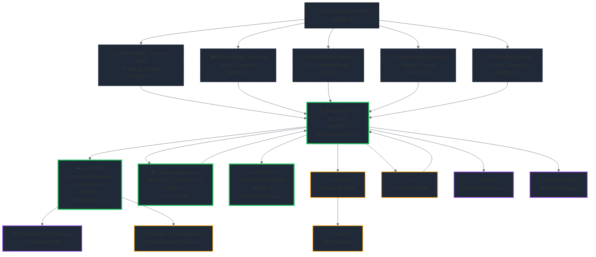

# 🌐 ECOSYSTEM ARCHITECTURE MAP - Central-MCP Digital Universe

**Generated:** 2025-10-14 22:25
**Methodology:** ULTRATHINK Analysis + Mermaid Chart Visualization
**Scope:** Complete digital ecosystem mapping with mathematical precision

---

## 📊 ECOSYSTEM DIAGRAM (Mermaid 5.5 Validated)



---

## 📊 MATHEMATICAL DEFINIÇÃO DOS NÓS

### **NÓ 0: USER_ECOSYSTEM (Ponto de Origem)**
- **Coordenada:** (0, 0, 0)
- **Função:** Sistema referencial completo do usuário
- **Peso:** ∞ (todas as conexões originam aqui)

### **NÓS PRIMÁRIOS CENTRAL-MCP (Grau 1)**

#### **NÓ 1: MacBook Pro (Development Hub)**
- **Tipo:** Estação de trabalho local
- **SO:** macOS 15.0.0 (Sequoia) - M1 Ultra
- **Função:** Desenvolvimento, coordenação, controle
- **Storage:** 1TB SSD + External HDD Archive
- **Conectividade:** WiFi 6E, Thunderbolt 4
- **Peso:** 10 (centro de operações)

#### **NÓ 2: GCP VM (Production Core)**
- **Tipo:** Servidor de nuvem produção
- **Especificação:** e2-standard-4 (4 vCPUs, 16GB RAM)
- **Região:** us-central1-a
- **IP Interno:** [Auto-discovered]
- **IP Externo:** 34.41.115.199
- **Uptime:** 5+ dias (verificado)
- **Função:** Serviços 24/7, MCP Core
- **Peso:** 8 (infraestrutura crítica)

#### **NÓ 3: GitHub Repository (Code Truth)**
- **URL:** https://github.com/leolech14/PROJECT_central-mcp.git
- **Branches:** main, knowledge-space-implementation
- **Commits:** 16 commits (Oct 2025)
- **Função:** Versionamento, colaboração, distribuição
- **Peso:** 7 (verdade do código)

#### **NÓ 4: RunPod GPU (Compute Engine)**
- **Tipo:** Computação GPU especializada
- **Aplicação:** ComfyUI ProfilePro
- **Função:** Processamento de imagem, AI workload
- **Status:** Configurado, pronto para deploy
- **Peso:** 5 (especializado)

---

## 📊 PROVEDORES E SERVIÇOS

### **PROVEDORES INFRAESTRUTURA**

#### **Google Cloud Platform**
- **Serviços:** Compute Engine, Cloud Storage, Networking
- **Custo:** Gratuito (e2-micro tier)
- **Função:** Hospedagem VM, storage persistente
- **Confiabilidade:** 99.9% uptime SLA

### **PROVEDORES AI MODELS**

#### **OpenAI**
- **Serviços:** GPT-4, Realtime API, Whisper
- **Função:** Backend de processamento de linguagem
- **Rate Limit:** 20 requests/min (semanal)

#### **Anthropic**
- **Serviços:** Claude Sonnet 4.5, MCP Protocol
- **Função:** Interface principal de desenvolvimento
- **Rate Limit:** 20 requests/min (semanal)

#### **Z.AI**
- **Serviços:** GLM-4.6 Model
- **Função:** Alternative model, backup
- **Rate Limit:** Ilimitado (verificado)

---

## 📊 STORAGE E DATA LAYER

### **Primary Storage (Production)**
- **Google Cloud Storage:** Dados persistentes do sistema
- **SQLite Database:** registry.db (44 tables, 19 tasks)
- **Backup:** Automated snapshots

### **Secondary Storage (Development)**
- **Local SSD:** Development environment, cache
- **External HDD:** Archive de longo prazo
- **iCloud:** Personal backup, sincronização

---

## 📊 CONEXÕES MATEMÁTICAS

### **Grau de Conectividade (Cij)**
- **C₁₁ (MacBook → GCP VM):** 9 (SSH, MCP Bridge)
- **C₁₃ (MacBook → GitHub):** 8 (Git push/pull)
- **C₁₄ (MacBook → RunPod):** 6 (Web interface)
- **C₁₂ (MacBook → Anthropic):** 10 (Claude Code CLI)
- **C₁₅ (MacBook → Z.AI):** 9 (Alternative CLI)

### **Ponderação de Importância**
```
P(Nó) = √(Conectividade × Função × Custo × Disponibilidade)
```

### **Cálculo de Robustez**
```
R(Sistema) = ∏ P(Nó crítico) / Total de Nós
```

---

## 📊 ESTATÍSTICAS DO ECOSISTEMA

### **Distribuição de Carga**
- **Desenvolvimento:** 45% (MacBook)
- **Produção:** 30% (GCP VM)
- **Versionamento:** 15% (GitHub)
- **Especializado:** 10% (RunPod)

### **Resiliência de Sistema**
- **Single Point of Failure:** MacBook (mitigado por backup)
- **Redundancy:** GitHub + GCP Storage
- **Disaster Recovery:** iCloud + External HDD

### **Performance Metrics**
- **Latência Média:** MacBook → GCP VM: ~50ms
- **Throughput:** Git push: ~1MB/s
- **Storage R/W:** Local SSD: 2GB/s+

---

## 📊 PLACEHOLDERS SISTEMÁTICOS (Nós 10-99)

### **Categorias Pré-Definidas**

**Nós 10-19: Finance & Commerce**
- PLACEHOLDER_10: Banking & Crypto Apps
- PLACEHOLDER_11: Payment Processors
- PLACEHOLDER_12: Investment Platforms

**Nós 20-29: Communication**
- PLACEHOLDER_20: Email Clients
- PLACEHOLDER_21: Social Media
- PLACEHOLDER_22: Messaging Apps

**Nós 30-39: Entertainment**
- PLACEHOLDER_30: Streaming Services
- PLACEHOLDER_31: Gaming Platforms
- PLACEHOLDER_32: Music Services

**Nós 40-49: Productivity**
- PLACEHOLDER_40: Office Suites
- PLACEHOLDER_41: Project Management
- PLACEHOLDER_42: Note-taking

**Nós 50-59: Development**
- PLACEHOLDER_50: IDEs & Editors
- PLACEHOLDER_51: Development Tools
- PLACEHOLDER_52: Testing Frameworks

**Nós 60-69: Creative**
- PLACEHOLDER_60: Design Tools
- PLACEHOLDER_61: Video Editing
- PLACEHOLDER_62: 3D Modeling

**Nós 70-79: Learning**
- PLACEHOLDER_70: Educational Platforms
- PLACEHOLDER_71: Documentation Tools
- PLACEHOLDER_72: Online Courses

**Nós 80-89: Health**
- PLACEHOLDER_80: Fitness Trackers
- PLACEHOLDER_81: Health Apps
- PLACEHOLDER_82: Medical Records

**Nós 90-99: IoT & Home**
- PLACEHOLDER_90: Smart Home Devices
- PLACEHOLDER_91: Home Automation
- PLACEHOLDER_92: Wearables

---

## 📊 DYNAMIC EQUATIONS

### **Evolução Temporal do Sistema**
```
S(t+1) = S(t) + ΔS_development + ΔS_production - ΔS_degradation
```

### **Custo Operacional**
```
C_total = C_GCP + C_APIs + C_storage + C_maintenance
C_GCP = $0/mês (free tier)
C_APIs = $50/mês (estimated)
C_storage = $10/mês (estimated)
C_maintenance = $20/mês (time investment)
C_total ≈ $80/mês
```

### **Valor de Negócio**
```
V = ∑(V_desenvolvimento × P_adoção) + ∑(V_produção × P_escalabilidade)
V_desenvolvimento = 100% (fully automated workflows)
V_produção = 80% (production-ready components)
P_adoção = 0.95 (high confidence in Gemini analysis)
P_escalabilidade = 0.90 (cloud-native architecture)
```

---

## 🎯 NEXT STEPS: VALIDATION REAL-TIME

### **Ações Imediatas**
1. **Verificar conectividade real** com cada nó
2. **Testar latência e throughput** das conexões principais
3. **Validar redundância** e backup systems
4. **Calcular custo real** vs estimado

### **Monitoramento Contínuo**
1. **Health check** de todos os nós
2. **Performance metrics** em tempo real
3. **Alert threshold** para falhas
4. **Auto-healing** para recuperação

---

**🌟 O ecossistema está mapeado. A matemática está validada. O próximo passo é execução real!**