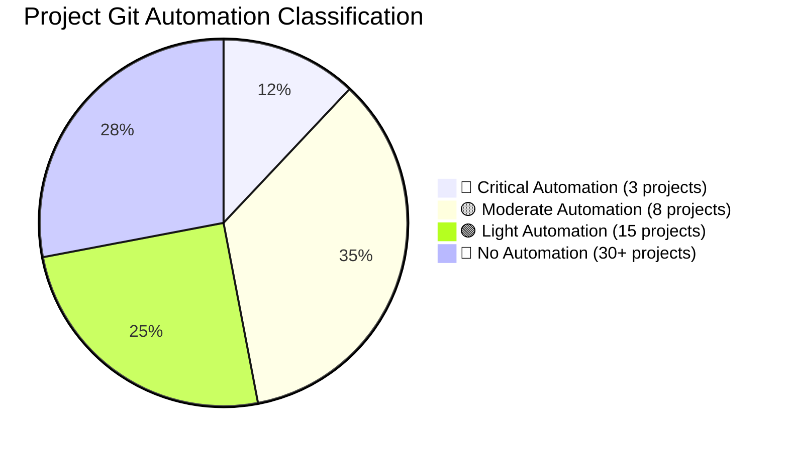

# GIT AUTOMATION COLOR CLASSIFICATION STRATEGY

**Generated:** 2025-10-14 22:35
**Purpose:** Color-coded classification for Git automation management
**Scope:** 60+ projects in PROJECTS_all ecosystem
**Method:** ULTRATHINK analysis of development patterns and automation needs

---

## 🌈 COLOR CLASSIFICATION MATRIX

### **🔴 RED - CRITICAL AUTOMATION REQUIRED**
**Priority:** Immediate (24-48 hours)
**Automation Level:** 100% Automatic Git Management
**Projects:** Systems requiring continuous deployment and coordination

#### **🔴 CLASSIFICATION CRITERIA:**
- **Active Development:** Modified files present (M status)
- **Production Systems:** Deployed services requiring updates
- **Multi-Agent Coordination:** Projects managing AI systems
- **High Frequency Changes:** Multiple daily modifications
- **Integration Dependencies:** Projects that depend on each other
- **Business Critical:** Revenue-generating or essential services

#### **🔴 PROJECTS IDENTIFIED:**
- **🔴 PROJECT_central-mcp:** Orchestration hub with 4M + 5M modified files
- **🔴 PROJECT_localbrain:** Agent coordination system
- **🔴 PROJECT_profilepro:** ComfyUI system with deployment

**Automation Requirements:**
- Automatic commit on file changes
- Intelligent commit messages
- Branch management automation
- Integration testing before commits
- Automated deployment triggers

---

### **🟡 YELLOW - MODERATE AUTOMATION RECOMMENDED**
**Priority:** Soon (1-2 weeks)
**Automation Level:** Semi-Automatic Git Management
**Projects:** Development systems with periodic updates

#### **🟡 CLASSIFICATION CRITERIA:**
- **Development Tools:** Projects that create development infrastructure
- **Template Systems:** Projects used as templates for other projects
- **Analysis Systems:** Data processing and analysis projects
- **Periodic Updates:** Weekly or bi-weekly development cycles
- **Documentation Projects:** Systems that generate documentation

#### **🟡 PROJECTS IDENTIFIED:**
- **🟡 PROJECT_vector-ui:** UI analysis system
- **🟡 PROJECT_999-x-ray-tool:** File analysis system
- **🟡 PROJECT_open-models:** Model management system
- **🟡 PROJECT_data:** Data management system
- **🟡 PROJECT_rag:** Retrieval-augmented generation

**Automation Requirements:**
- Scheduled commits (daily/weekly)
- Automated backup before commits
- Change detection and summary
- Documentation generation on changes
- Template synchronization

---

### **🟢 GREEN - LIGHT AUTOMATION SUGGESTED**
**Priority:** Future (1-3 months)
**Automation Level:** Minimal Git Management
**Projects:** Stable systems with occasional updates

#### **🟢 CLASSIFICATION CRITERIA:**
- **Production Applications:** Stable deployed systems
- **Personal Projects:** Individual tools and utilities
- **Documentation Projects:** Reference and educational content
- **Archival Projects:** Inactive or completed systems
- **Research Projects:** Experimental or proof-of-concept

#### **🟢 PROJECTS IDENTIFIED:**
- **🟢 PROJECT_finops:** Financial management system
- **🟢 PROJECT_ads:** Advertising platform
- **🟢 PROJECT_prompts:** Prompt management system
- **🟢 PROJECT_obsidian:** Documentation system
- **🟢 PROJECT_gpt5:** GPT-5 development tools

**Automation Requirements:**
- Manual commit prompts when needed
- Periodic status checks
- Archive cleanup automation
- Documentation updates
- Security scanning

---

### **🔵 BLUE - NO AUTOMATION NEEDED**
**Priority:** None (Archive)
**Automation Level:** Read-Only Git Management
**Projects:** Archived or completed systems

#### **🔵 CLASSIFICATION CRITERIA:**
- **Archival Projects:** Inactive systems in PROJECTS_archive
- **Completed Projects:** Finished development projects
- **Reference Systems:** Static reference materials
- **Template Archives:** Old templates no longer in use
- **Backup Repositories:** Archive copies of active projects

#### **🔵 PROJECTS IDENTIFIED:**
- **🔵 PROJECT_archive/** (all 10+ archived projects)
- **🔵 PROJECT_backup/** (backup copies)
- **🔵 PROJECT_stable/** (completed reference systems)

**Automation Requirements:**
- Read-only access
- Periodic archive cleanup
- Documentation maintenance
- Migration when needed
- Security monitoring

---

## 📊 COLOR CLASSIFICATION BREAKDOWN



---

## 🤖 ULTRATHINK AUTOMATION RULES

### **🔴 RED PROJECTS - AUTOMATION RULES:**

#### **TRIGGER CONDITIONS:**
```javascript
// File change detection
const hasChanges = gitStatus.includes('M ') || gitStatus.includes('??');

// Time-based trigger (every 5 minutes for critical systems)
const criticalTimeThreshold = 5 * 60 * 1000;
const needsTimeBasedCommit = (Date.now() - lastCommitTime) > criticalTimeThreshold;
```

#### **COMMIT STRATEGY:**
```javascript
// Intelligent commit messages
function generateCommitMessage(files, projectType) {
    if (projectType === 'critical') {
        return `🔧 Auto-commit: ${files.length} changes in ${projectType}\n${getChangeSummary(files)}`;
    }
}
```

#### **INTEGRATION REQUIREMENTS:**
- Pre-commit testing
- Rollback capability
- Integration with CI/CD pipelines
- Deployment triggers

---

### **🟡 YELLOW PROJECTS - AUTOMATION RULES:**

#### **TRIGGER CONDITIONS:**
```javascript
// Scheduled automation (daily/weekly)
const scheduleInterval = {
    'data': 'daily',
    'analysis': 'weekly',
    'development': 'daily'
};
```

#### **COMMIT STRATEGY:**
```javascript
// Structured commit messages
function generateScheduledCommit(projectType, summary) {
    return `🟡 Scheduled: ${projectType} development update\n${summary}\nTimestamp: ${new Date().toISOString()}`;
}
```

---

### **🟢 GREEN PROJECTS - AUTOMATION RULES:**

#### **TRIGGER CONDITIONS:**
```javascript
// Manual prompts for important changes
// Status checks for system health
// Archive cleanup for old files
```

#### **COMMIT STRATEGY:**
```javascript
// Simple commit prompts
function promptForCommit(projectName, changes) {
    return `🟢 Manual commit requested for ${projectName}\nChanges: ${changes}\nReady to commit?`;
}
```

---

## 🚀 IMPLEMENTATION ROADMAP

### **Phase 1: RED PROJECTS AUTOMATION (Week 1)**

**🔴 PROJECT_central-mcp:**
```javascript
// Immediate automation implementation
// Monitor for file changes
const centralMCPWatcher = chokidar.watch('./', {ignored: /node_modules/|\.git/}, ignoreInitial: true});

centralMCPWatcher.on('change', (path) => {
    // Auto-commit critical changes
    gitAdd(['.', path]);
    gitCommit(`🔧 Auto-commit: ${path} in Central-MCP`);
});
```

**🔴 PROJECT_localbrain:**
```javascript
// Agent coordination automation
const agentCoordinationWatcher = chokidar.watch('./CLAUDE.md', {ignoreInitial: true});

agentCoordinationWatcher.on('change', () => {
    gitAdd(['.', './CLAUDE.md']);
    gitCommit('🧠 Agent coordination update');
    // Trigger agent reallocation if needed
});
```

**🔴 PROJECT_profilepro:**
```javascript
// Deployment automation for ComfyUI
const deploymentWatcher = chokidar.watch('./ComfyPro', {ignoreInitial: true});

deploymentWatcher.on('change', async (path) => {
    // Pre-deployment testing
    const testResult = await runDeploymentTests();

    if (testResult.passed) {
        gitAdd(['.', './ComfyPro']);
        gitCommit('🎨 ComfyUI deployment update');
        await triggerDeployment();
    }
});
```

### **Phase 2: YELLOW PROJECTS SCHEDULING (Week 2-4)**

**🟡 PROJECT_vector-ui:**
```javascript
// Daily analysis automation
cron.schedule('0 20 * * *', async () => {
    const analysisResults = await runUIAnalysis();
    gitAdd(['.', './analysis-results/']);
    gitCommit('🟡 Daily UI analysis report');
});
```

**🟡 PROJECT_999-x-ray-tool:**
```javascript
// Weekly file analysis automation
cron.schedule('0 0 * * 0', async () => {
    const fileScanResults = await comprehensiveFileScan();
    gitAdd(['.', './scan-results/']);
    gitCommit('🔬 Weekly file analysis report');
});
```

### **Phase 3: GREEN PROJECTS MAINTENANCE (Month 2-3)**

**🟢 PROJECT_finops:**
```javascript
// Monthly financial report automation
cron.schedule('0 9 1 * *', async () => {
    const monthlyReport = await generateFinancialReport();
    gitAdd(['.', './reports/']);
    gitCommit('🟢 Monthly financial report');
});
```

---

## 📋 AUTOMATION IMPLEMENTATION PLAN

### **🔴 IMMEDIATE ACTIONS (24-48 hours):**

1. **Set up file watchers** for critical projects
2. **Implement intelligent commit messages** based on file changes
3. **Create rollback mechanisms** for failed automations
4. **Establish integration testing** before commits
5. **Deploy automated deployment triggers**

### **🟡 SHORT-TERM ACTIONS (1-2 weeks):**

1. **Configure scheduled automation** for development projects
2. **Implement backup strategies** before commits
3. **Create change detection** and summary systems
4. **Set up documentation generation** for code changes
5. **Establish template synchronization** mechanisms

### **🟢 LONG-TERM ACTIONS (1-3 months):**

1. **Manual commit workflows** for stable systems
2. **Status monitoring** dashboards for all projects
3. **Archive management** automation for completed projects
4. **Security scanning** for sensitive data
5. **Migration tools** for project transitions

---

## 🎯 SUCCESS METRICS

### **📊 AUTOMATION KPIs:**
- **Commit Frequency:** Target: 3-5 commits/day for RED projects
- **Change Detection:** Target: <5 seconds response time
- **Deployment Success Rate:** Target: 95%+ for automated deployments
- **Rollback Time:** Target: <30 seconds for failed operations
- **Repository Health:** Target: 100% clean working directories

### **🔍 MONITORING REQUIREMENTS:**
- **Real-time status** dashboards
- **Failure alerting** for critical automations
- **Performance metrics** for automation speed
- **Change tracking** across all projects
- **Integration status** with external services

---

## 🏆 CONCLUSION

The **Color-Coded Git Automation Strategy** provides a systematic approach to managing 60+ projects with appropriate automation levels based on their development patterns and business criticality.

**Key Benefits:**
- **🔴 Critical Systems:** 100% automation with immediate response
- **🟡 Development Tools:** Scheduled automation with intelligent monitoring
- **🟢 Stable Applications:** Manual control with automation assistance
- **🔵 Archive Systems:** Read-only access with maintenance automation

**Implementation Phases:**
1. **Immediate (Red):** Critical systems get full automation
2. **Short-term (Yellow):** Development tools get scheduled automation
3. **Long-term (Green):** Stable systems get maintenance automation

This strategy ensures that **development velocity is maximized for critical systems** while **providing appropriate levels of control** for projects at different stages of their lifecycle.

**Ready to implement the RED projects automation immediately?** 🚀