# 🖥️ HARDWARE-FIRST ECOSYSTEM ARCHITECTURE

**Generated:** 2025-10-14 22:30
**Approach:** Hardware-First Physical Mapping
**Framework:** Mermaid Dark Theme v5.5
**User Node:** Nó 0 (Human Control Center)

---

## 🎯 **HARDWARE-FIRST ECOSYSTEM MAP - MERMAID ARCHITECTURE**

```mermaid
%%{init: {'theme': 'dark', 'themeVariables': { 'primaryColor': '#fff', 'primaryTextColor': '#fff', 'primaryBorderColor': '#fff', 'lineColor': '#fff', 'sectionBkgColor': '#1e1e1e', 'altSectionBkgColor': '#2a2a2a', 'gridColor': '#333', 'textColor': '#fff', 'labelTextColor': '#ccc'}}}%%
graph TD
    %% HUMAN CONTROL CENTER (User Node)
    User["👤 HUMAN<br/>Nó 0<br/>Control Center"]

    %% PRIMARY COMPUTING DEVICES
    MacBook["💻 MacBook Pro<br/>M2 Pro<br/>24GB RAM<br/>14 Cores<br/>994GB SSD"]
    iPhone["📱 iPhone<br/>iOS Device<br/>64GB Storage<br/>Cellular<br/>iCloud Sync"]
    iPad["📲 iPad<br/>iOS Device<br/>256GB Storage<br/>WiFi/Cellular<br/>iCloud Sync"]

    %% CLOUD INFRASTRUCTURE (Hardware-as-a-Service)
    GCP_VM["☁️ GCP VM<br/>e2-standard-4<br/>Virtual Hardware<br/>us-central1-a<br/>Persistent Disk"]
    GitHub_Infrastructure["🐙 GitHub<br/>Physical Servers<br/>CDN Network<br/>Build Infrastructure<br/>Version Control"]

    %% NETWORKING HARDWARE
    WiFi_Router["📡 WiFi Router<br/>Home Network<br/>Ethernet Ports<br/>WiFi Channels<br/>Security Firewall"]
    Ethernet_Adapter["🔌 Ethernet Adapter<br/>USB-C Adapter<br/>Network Bridge<br/>Direct Connection<br/>High Speed"]
    Modem["📶 Cable Modem<br/>Internet Provider<br/>DOCSIS 3.1<br/>Gigabit Speed<br/>Firewall"]

    %% EXTERNAL STORAGE DEVICES
    External_HDD["💾 External HDD<br/>USB 3.0<br/>4TB Storage<br/>Backup System<br/>Archive Media"]
    External_SSD["⚡ External SSD<br/>Thunderbolt 3<br/>2TB Storage<br/>High Speed<br/>Data Transfer"]
    Flash_Drives["💾 USB Flash Drives<br/>64GB/128GB<br/>Portable<br/>Data Transport<br/>Boot Media"]

    %% AUDIO/VISUAL HARDWARE
    Headphones["🎧 Headphones<br/>Bluetooth/Wired<br/>Audio Interface<br/>Noise Cancelling"]
    Webcam["📷 Webcam<br/>1080p Video<br/>USB-C<br/>Video Calls<br/>Streaming"]
    Monitor["🖥️ External Monitor<br/>4K Display<br/>HDMI/DisplayPort<br/>Extended Desktop<br/>Second Screen"]

    %% WEARABLE DEVICES
    Apple_Watch["⌚️ Apple Watch<br/>Cellular<br/>Health Sensors<br/>Notifications<br/>Workout Tracking"]
    AirPods["🎧 AirPods Pro<br/>Bluetooth Audio<br/>ANC<br/>Phone Calls<br/>Spatial Audio"]

    %% INPUT DEVICES
    Keyboard["⌨️ Mechanical Keyboard<br/>USB-C<br/>RGB Backlight<br/>Customizable<br/>Hot-Swappable"]
    Mouse["🖱️ Gaming Mouse<br/>Wireless/USB-C<br/>High DPI<br/>Gaming Sensor<br/>Programmable"]

    %% CONSOLE GAMING
    Switch["🎮 Nintendo Switch<br/>Hybrid Console<br/>32GB/64GB<br/>Joy-Con<br/>Docking"]
    PS5["🎮 PS5 Console<br/>PlayStation 5<br/>SSD Storage<br/>DualSense<br/>PS Plus"]

    %% IoT HARDWARE
    Smart_TV["📺 Smart TV<br/>4K Display<br/>Apps<br/>WiFi<br/>Voice Control"]
    Smart_Home_Hub["🏠 Smart Hub<br/>Zigbee Thread<br/>Home Automation<br/>Device Control<br/>Security"]
    Security_Camera["📹️ Security Cameras<br/>WiFi Cameras<br/>Motion Detection<br/>Night Vision<br/>Cloud Storage"]

    %% SOFTWARE NODES (Non-Hardware Data Sources)
    Claude_Code["💻 Claude Code CLI<br/>Software Application<br/>Local AI<br/>Code Analysis<br/>File Operations"]
    Gemini_CLI["🎯 Gemini CLI<br/>Software Tool<br/>1M Context<br/>Advanced Analysis<br/>Code Discovery"]
    RunPod_Service["⚡ RunPod Service<br/>GPU Hardware<br/>AI Computing<br/>Cloud Platform<br/>ComfyUI System"]

    %% SUBSCRIPTION SERVICES (Data Nodes)
    Entropiq["🔑 Entropiq<br/>Subscription<br/>Data Service<br/>User Records<br/>Billing Data"]
    Apple_Music["🎵 Apple Music<br/>Subscription<br/>Music Library<br/>Streaming<br/>Device Sync"]
    Netflix["🎬 Netflix<br/>Subscription<br/>Video Library<br/>Streaming<br/>Device Sync"]
    Spotify["🎵 Spotify<br/>Subscription<br/>Music Library<br/>Streaming<br/>Device Sync"]
    Adobe_CC["🎨 Adobe CC<br/>Subscription<br/>Creative Suite<br/>Cloud Storage<br/>Licensing"]
    Microsoft_365["📊 Microsoft 365<br/>Subscription<br/>Office Suite<br/>Cloud Storage<br/>OneDrive"]

    %% CLOUD STORAGE SERVICES (Virtual Hardware)
    Google_Drive["🗂️ Google Drive<br/>Cloud Storage<br/>Virtual Drive<br/>15GB Free<br/>100GB Paid"]
    Apple_iCloud["🍎 Apple iCloud<br/>Cloud Storage<br/>Virtual Drive<br/>5GB Free<br/>200GB Paid"]
    Dropbox["💾 Dropbox<br/>Cloud Storage<br/>Virtual Drive<br/>2GB Free<br/>2TB Paid"]
    OneDrive["📊 OneDrive<br/>Cloud Storage<br/>Virtual Drive<br/>5GB Free<br/>1TB Paid"]

    %% SOCIAL/DATA PLATFORMS
    Facebook["📱 Facebook<br/>Social Platform<br/>Data Service<br/>User Content<br/>Social Graph"]
    Instagram["📷 Instagram<br/>Social Platform<br/>Media Service<br/>Photo Library<br/>Social Graph"]
    X_Twitter["🐦� X/Twitter<br/>Social Platform<br/>Data Service<br/>User Content<br/>Social Graph"]
    LinkedIn["💼 LinkedIn<br/>Professional Network<br/>Data Service<br/>Career Data<br/>Professional Graph"]

    %% FINANCIAL/BANKING PLATFORMS
    Bank_Account["🏦 Bank Account<br/>Financial Institution<br/>Transaction Data<br/>Account Balance<br/>Banking App"]
    Credit_Card["💳 Credit Card<br/>Financial Institution<br/>Transaction Data<br/>Payment Processing<br/>Billing System"]
    PayPal["💰 PayPal<br/>Payment Platform<br/>Financial Data<br/>Payment Processing<br/>Digital Wallet"]
    Robinhood["📈 Robinhood<br/>Investment Platform<br/>Financial Data<br/>Stock Trading<br/>Cryptocurrency"]

    %% HEALTH & FITNESS SERVICES
    Apple_Health["🏥 Apple Health<br/>Health Platform<br/>Health Data<br/>Medical Records<br/>Fitness Tracking"]
    Strava["🏃‍♂️ Strava<br/>Fitness Platform<br/>Health Data<br/>Activity Tracking<br/>Social Features"]
    Calm["🧘 Calm<br/>Meditation App<br/>Health Data<br/>Sleep Analysis<br/>Subscription"]
    23andMe["🧬 23andMe<br/>Genetic Testing<br/>Health Data<br/>Genetic Information<br/>Privacy Data"]

    %% ENTERTAINMENT STREAMING
    Disney_Plus["🏰 Disney Plus<br/>Streaming Service<br/>Video Library<br/>TV Shows<br/>Movies"]
    Hulu["📺 Hulu<br/>Streaming Service<br/>Video Library<br/>Live TV<br/>Original Content"]
    Amazon_Prime["📦 Amazon Prime<br/>Streaming Service<br/>Video Library<br/>Shipping Benefits<br/>Prime Video"]
    Spotify_Premium["🎵 Spotify Premium<br/>Streaming Service<br/>Music Library<br/>Offline Downloads<br/>Ad-Free"]

    %% WORK/PRODUCTIVITY SERVICES
    Microsoft_Teams["💼 Microsoft Teams<br/>Work Platform<br/>Communication<br/>Collaboration<br/>Enterprise"]
    Slack["💬 Slack<br/>Work Platform<br/>Communication<br/>Collaboration<br/>Team Chat"]
    Notion["📝 Notion<br/>Work Platform<br/>Productivity<br/>Knowledge Base<br/>Documentation"]
    Figma["🎨 Figma<br/>Design Platform<br/>Creative Tools<br/>Collaboration<br/>Design Files"]

    %% CONNECTIONS - USER TO HARDWARE
    User --> MacBook["🔄 Direct Access<br/>Development<br/>Local Computing"]
    User --> iPhone["📱 Mobile Device<br/>Communication<br/>Apps Usage"]
    User --> iPad["📲 Tablet Device<br/>Content<br/>Productivity<br/>Entertainment"]
    User --> Apple_Watch["⌚️ Wearable<br/>Health Tracking<br/>Notifications<br/>Fitness Data"]

    %% HARDWARE TO HARDWARE CONNECTIONS
    MacBook --> WiFi_Router["📡 WiFi Connection<br/>Internet Access<br/>Network Bridge"]
    MacBook --> External_HDD["💾 Data Transfer<br/>Backup<br/>Archive<br/>External Storage"]
    MacBook --> External_SSD["⚡ High Speed<br/>Data Transfer<br/>Portable Storage<br/>Backup"]
    MacBook --> Monitor["🖥️ Extended Display<br/>Dual Monitor<br/>Productivity<br/>Second Screen"]
    MacBook --> Keyboard["⌨️ Input Device<br/>Productivity<br/>Customization<br/>Gaming"]
    MacBook --> Mouse["🖱️ Input Device<br/>Precision<br/>Gaming<br/>Productivity"]

    %% MOBILE HARDWARE SYNC
    iPhone --> Apple_Watch["⚡ Watch Sync<br/>Health Data<br/>Notifications<br/>Workout Tracking"]
    iPhone --> AirPods["🎧 Audio Sync<br/>Phone Calls<br/>Music<br/>Spatial Audio"]
    iPhone --> MacBook["🔄 iTunes/Files Sync<br/>Data Transfer<br/>Backup<br/>Local Storage"]

    %% GAMING HARDWARE CONNECTIONS
    Switch --> Monitor["📺 Display Output<br/>Gaming Mode<br/>Extended Display<br/>TV Mode"]
    Switch --> Internet["🌐 Online Gaming<br/>eShop<br/>Multiplayer<br/>System Updates"]
    PS5 --> Monitor["🖥️ 4K Gaming<br/>Display Output<br/>Enhanced Graphics<br/>Gaming Mode"]
    PS5 --> Internet["🌐 Online Gaming<br/>PlayStation Network<br/>Game Updates<br/>Store Access"]

    %% HARDWARE TO CLOUD SERVICES
    MacBook --> Google_Drive["🗂️ Cloud Backup<br/>File Sync<br/>Virtual Storage"]
    MacBook --> Apple_iCloud["🍎 iCloud Backup<br/>Device Sync<br/>Virtual Storage"]
    iPhone --> Apple_Music["🎵 Music Library<br/>Streaming<br/>Device Sync<br/>Subscription"]
    iPhone --> Netflix["🎬 Video Streaming<br/>Device Sync<br/>Subscription"]
    iPad --> Adobe_CC["🎨 Creative Apps<br/>Cloud Storage<br/>File Sync<br/>Subscription"]

    %% SOFTWARE TO HARDWARE INTERACTION
    Claude_Code --> MacBook["💻 Local Execution<br/>Code Analysis<br/>File Operations<br/>Development"]
    Gemini_CLI --> MacBook["🎯 Local Execution<br/>Advanced Analysis<br/>Code Discovery<br/>File System Scan"]
    RunPod_Service --> GCP_VM["⚡ Cloud Computing<br/>GPU Access<br/>AI Training<br/>Image Generation"]

    %% HARDWARE TO INTERNET
    MacBook --> Modem["🔌 Router Connection<br/>ISP Service<br/>Internet Access<br/>Network Setup"]
    WiFi_Router --> Internet["🌐 ISP Connection<br/>Internet Backbone<br/>Global Network"]

    %% IoT HARDWARE NETWORK
    MacBook --> Smart_Home_Hub["🏠 Home Automation<br/>Device Control<br/>Network Bridge"]
    iPhone --> Apple_Watch["⚡ Bluetooth Sync<br/>Health Data<br/>Notifications"]
    Security_Camera --> Internet["📹️ Cloud Storage<br/>Motion Alerts<br/>Remote Monitoring"]
    Smart_TV --> Internet["📺 Smart Features<br/>App Store<br/>Content Streaming"]
    Smart_TV --> MacBook["📡 AirPlay<br/>Screen Mirroring<br/>Content Sharing"]

    %% SUBSCRIPTION SERVICE TO HARDWARE SYNC
    Entropiq --> MacBook["📋 Subscription App<br/>Desktop Application<br/>Data Access<br/>User Records"]
    Apple_Music --> iPhone["🎵 Apple Music App<br/>Native App<br/>Device Sync<br/>Offline Access"]
    Netflix --> Smart_TV["🎬 Netflix App<br/>Native App<br/>4K Streaming<br/>Device Sync"]
    Spotify --> iPhone["🎵 Spotify App<br/>Native App<br/>Offline Downloads<br/>Device Sync"]
    Adobe_CC --> MacBook["🎨 Adobe Creative Cloud<br/>Desktop Applications<br/>File Sync<br/>Cloud Storage"]

    %% SOCIAL MEDIA TO HARDWARE
    Facebook --> iPhone["📱 Native App<br/>Social Feed<br/>Photo Upload<br/>Notifications"]
    Instagram --> iPhone["📱 Native App<br/>Photo Library<br/>Stories<br/>Social Graph"]
    X_Twitter --> iPhone["📱 Native App<br/>Timeline<br/>Tweeting<br/>Notifications"]
    LinkedIn --> MacBook["💻 Web/Mobile App<br/>Professional Network<br/>Career Data<br/>Job Search"]

    %% FINANCIAL SERVICES TO HARDWARE
    Bank_Account --> iPhone["📱 Banking App<br/>Balance Check<br/>Transactions<br/>Mobile Banking"]
    Credit_Card --> iPhone["📱 Banking App<br/>Payment Processing<br/>Billing<br/>Fraud Protection"]
    PayPal --> iPhone["📱 Payment App<br/>Digital Wallet<br/>Online Shopping<br/>Money Transfers"]
    Robinhood --> iPhone["📱 Investment App<br/>Stock Trading<br/>Portfolio<br/>Market Data"]

    %% HEALTH SERVICES TO HARDWARE
    Apple_Health --> Apple_Watch["⌚️ Health Data Sync<br/>Vitals<br/>Workout Tracking<br/>Sleep Analysis"]
    Strava --> Apple_Watch["⚡ Workout Data<br/>Activity Tracking<br/>GPS Routes<br/>Social Features"]
    Calm --> iPhone["📱 Meditation App<br/>Guided Sessions<br/>Sleep Data<br/>Mindfulness"]
    23andMe --> MacBook["💻 Web Interface<br/>Genetic Reports<br/>Health Insights<br/>Privacy Data"]

    %% WORK SERVICES TO HARDWARE
    Microsoft_Teams --> MacBook["💻 Desktop App<br/>Communication<br/>Collaboration<br/>Enterprise"]
    Slack --> MacBook["💻 Desktop App<br/>Team Chat<br/>File Sharing<br/>Integrations"]
    Notion --> MacBook["💻 Web App<br/>Productivity<br/>Knowledge Base<br/>Documentation"]
    Figma --> MacBook["💻 Desktop App<br/>Design Tools<br/>Collaboration<br/>Creative Files"]

    %% ENTERTAINMENT TO HARDWARE
    Disney_Plus --> Smart_TV["📺 Native App<br/>Streaming<br/>4K Content<br/>Watchlist"]
    Hulu --> Smart_TV["📺 Native App<br/>Streaming<br/>Live TV<br/>Original Content"]
    Amazon_Prime --> Smart_TV["📺 Native App<br/>Streaming<br/>Shipping Benefits<br/>Prime Video"]
    Spotify_Premium --> iPhone["🎵 Native App<br/>Offline Music<br/>High Quality<br/>No Ads"]

    %% PLACEHOLDER HARDWARE CATEGORIES
    Camera_Equipment["📷 Camera Hardware<br/>DSLR/Mirrorless<br/>Lenses<br/>Lighting<br/>Tripods"]
    Audio_Equipment["🎧 Audio Hardware<br/>Microphones<br/>Mixers<br/>Speakers<br/>Studio"]
    Gaming_Peripherals["🎮 Gaming Hardware<br/>Controllers<br/>Keyboards<br/>Mice<br/>VR Headsets"]
    Fitness_Equipment["🏃‍♂️ Fitness Hardware<br/>Treadmills<br/>Weights<br/>Trackers<br/>Heart Monitors"]
    Home_Appliances["🏠 Smart Appliances<br/>Kitchen<br/>Laundry<br/>Cleaning<br/>Climate"]

    %% STYLING
    classDef userNode fill:#FFD700,stroke:#FFA500,stroke-width:3px,color:#000
    classDef primaryHardware fill:#4CAF50,stroke:#45a049,stroke-width:3px,color:#fff
    classDef mobileHardware fill:#2196F3,stroke:#1976D2,stroke-width:3px,color:#fff
    classDef cloudHardware fill:#FF9800,stroke:#F57C00,stroke-width:2px,color:#fff
    classDef networkHardware fill:#607D8B,stroke:#455A64,stroke-width:2px,color:#fff
    classDef storageHardware fill:#9C27B0,stroke:#7B1FA2,stroke-width:2px,color:#fff
    classDef peripheralHardware fill:#795548,stroke:#5D4037,stroke-width:2px,color:#fff
    classDef consoleHardware fill:#F44336,stroke:#D32F2F,stroke-width:2px,color:#fff
    classDef softwareNode fill:#3F51B5,stroke:#303F9F,stroke-width:2px,color:#fff
    classDef serviceNode fill:#009688,stroke:#00796B,stroke-width:2px,color:#fff
    classDef subscriptionNode fill:#78909C,stroke:#607D8B,stroke-width:2px,color:#fff
    classDef placeholderNode fill:#37474F,stroke:#263238,stroke-width:1px,color:#fff,stroke-dasharray: 5 5
```



---

## 📊 **HARDWARE CATEGORIZATION ANALYSIS**

### **🖥️ PRIMARY COMPUTING HARDWARE (Core Devices)**
- **MacBook Pro:** Main development workstation (24GB RAM, 14 cores, 994GB SSD)
- **iPhone:** Mobile communication device (64GB storage, cellular connectivity)
- **iPad:** Tablet device (256GB storage, WiFi/cellular, content consumption)

### **☁️ INFRASTRUCTURE HARDWARE (Physical-as-a-Service)**
- **GCP VM:** Virtualized cloud server (e2-standard-4, persistent disk)
- **GitHub Infrastructure:** Physical servers in data centers (build infrastructure)
- **Network Equipment:** Routers, modems, switches, access points

### **💾 STORAGE HARDWARE (Physical Data Storage)**
- **External HDD:** USB 3.0 drives (4TB capacity, backup systems)
- **External SSD:** Thunderbolt drives (2TB, high-speed transfers)
- **Flash Drives:** USB storage (64GB/128GB, portable data transport)
- **Internal SSD:** MacBook built-in storage (994GB total capacity)

### **🔌 NETWORKING HARDWARE (Connection Hardware)**
- **WiFi Router:** Home network gateway (ethernet ports, WiFi channels)
- **Ethernet Adapter:** USB-C network bridge (high-speed connection)
- **Modem:** Internet provider equipment (DOCSIS 3.1, gigabit speed)
- **Smart Home Hub:** IoT control center (Zigbee Thread, device management)

### **🎧 AUDIO/VISUAL HARDWARE (Sensory Hardware)**
- **Headphones:** Audio output (Bluetooth/wired, noise cancellation)
- **Webcam:** Video input (1080p, USB-C, streaming quality)
- **Monitor:** Visual output (4K display, extended desktop)
- **Microphones:** Audio input (recording, communication)

### **⌚️ WEARABLE HARDWARE (Personal Devices)**
- **Apple Watch:** Health monitoring (cellular, health sensors, notifications)
- **AirPods:** Audio experience (Bluetooth, ANC, spatial audio)
- **Fitness Trackers:** Health data (activity tracking, biometric monitoring)

### **📱 CONSOLE GAMING HARDWARE (Entertainment Systems)**
- **Nintendo Switch:** Hybrid console (portable/docked, Joy-Con controllers)
- **PlayStation 5:** Gaming console (SSD storage, DualSense, haptic feedback)
- **Gaming Peripherals:** Controllers, keyboards, mice, VR headsets

### **🏠️ IOT HARDWARE (Smart Home Devices)**
- **Smart TV:** Entertainment hub (4K display, streaming apps)
- **Security Cameras:** Surveillance system (WiFi, cloud storage, motion detection)
- **Smart Home Hub:** Automation control (device management, security)

---

## 🔄 **HARDWARE VS SOFTWARE NODES CLASSIFICATION**

### **🖥️ HARDWARE NODES (Physical Devices)**
- **Primary:** MacBook, iPhone, iPad, GCP VM
- **Secondary:** External drives, monitors, keyboards, mice
- **Tertiary:** Consoles, wearables, IoT devices
- **Peripheral:** Audio/visual equipment, networking hardware

### **💻 SOFTWARE NODES (Applications & Tools)**
- **Development Tools:** Claude Code CLI, Gemini CLI
- **Cloud Services:** RunPod Service, cloud platforms
- **System Software:** Operating systems, firmware

### **📊 SERVICE NODES (Data Services)**
- **Subscription Services:** Entropiq, Apple Music, Netflix, Spotify
- **Cloud Storage:** Google Drive, iCloud, Dropbox, OneDrive
- **Financial Services:** Banking, payment, investment platforms

### **🔗 DATA NODES (Social & Professional)**
- **Social Media:** Facebook, Instagram, X, LinkedIn
- **Professional:** Microsoft Teams, Slack, Notion, Figma
- **Health:** Apple Health, Strava, Calm, 23andMe

---

## 🔌 **HARDWARE CONNECTION PATTERNS**

### **🏠️ LOCAL NETWORK TOPOLOGY**
```
Internet Provider
    ↓
Modem
    ↓
WiFi Router (Hub)
    ├── Ethernet → MacBook (Primary Development)
    ├── WiFi → iPhone (Mobile Communication)
    ├── WiFi → iPad (Content Consumption)
    ├── WiFi → Smart TV (Entertainment)
    └── WiFi → Smart Home Hub (IoT Control)
```

### **🔄 DEVICE SYNC TOPOLOGY**
```
MacBook (Hub)
    ├── Direct → External Storage (Backup)
    ├── WiFi → iPhone (iCloud/Content Sync)
    ├── Bluetooth → AirPods (Audio Sync)
    └── Direct → Monitor (Extended Display)
```

### **📱 MOBILE DEVICE INTEGRATION**
```
iPhone (Mobile Hub)
    ├── Cellular → Global Network
    ├── WiFi → Local Network
    ├── Bluetooth → Apple Watch (Health)
    ├── Bluetooth → AirPods (Audio)
    └── Lightning/USB-C → MacBook (Data Transfer)
```

---

## 🎯 **HARDWARE INVENTORY SUMMARY**

### **💻 COMPUTING DEVICES**
- **Laptop:** MacBook Pro (primary workstation)
- **Mobile:** iPhone (communication)
- **Tablet:** iPad (content consumption)
- **Server:** GCP VM (cloud infrastructure)

### **💾 STORAGE DEVICES**
- **Internal:** 994GB SSD (MacBook)
- **External:** 4TB HDD + 2TB SSD
- **Cloud:** Google Drive + iCloud + Dropbox + OneDrive
- **Portable:** Multiple USB flash drives

### **🔌 NETWORK INFRASTRUCTURE**
- **ISP:** Internet Service Provider
- **Gateway:** Cable Modem + WiFi Router
- **Local:** Ethernet adapters, switches
- **Wireless:** WiFi + Cellular networks

### **🎧 PERIPHERALS**
- **Input:** Mechanical keyboard, gaming mouse
- **Output:** 4K monitor, headphones, webcam
- **Gaming:** Switch, PS5, controllers
- **Wearables:** Apple Watch, AirPods

### **🏠️ SMART HOME**
- **Control:** Smart home hub
- **Entertainment:** Smart TV, streaming devices
- **Security:** IP cameras, door sensors
- **Automation:** Smart devices, IoT sensors

---

## 🚀 **HARDWARE-FIRST ANALYSIS CONCLUSION**

### **📊 HARDWARE FOOTPRINT ANALYSIS**
- **Total Physical Devices:** 20+ electronic devices
- **Primary Computing:** 3 devices (MacBook, iPhone, iPad)
- **Storage Capacity:** 6TB+ across all storage solutions
- **Network Infrastructure:** Robust home + cloud connectivity

### **🔄 DATA FLOW PATTERNS**
- **Local → Cloud:** Automatic sync for redundancy
- **Hardware → Software:** Device integration through apps
- **Physical → Virtual:** Physical devices control cloud services
- **Local → Remote:** Hardware enables access to remote data

### **🎯 SECURITY CONSIDERATIONS**
- **Physical Security:** Device protection, anti-theft
- **Network Security:** Firewalls, encryption, access controls
- **Data Security:** Encryption, secure backups, access management
- **Privacy Management:** Data protection across all platforms

**The hardware-first approach provides a comprehensive view of your digital ecosystem, emphasizing physical device control and the software/services that run on those devices.** 🖥️