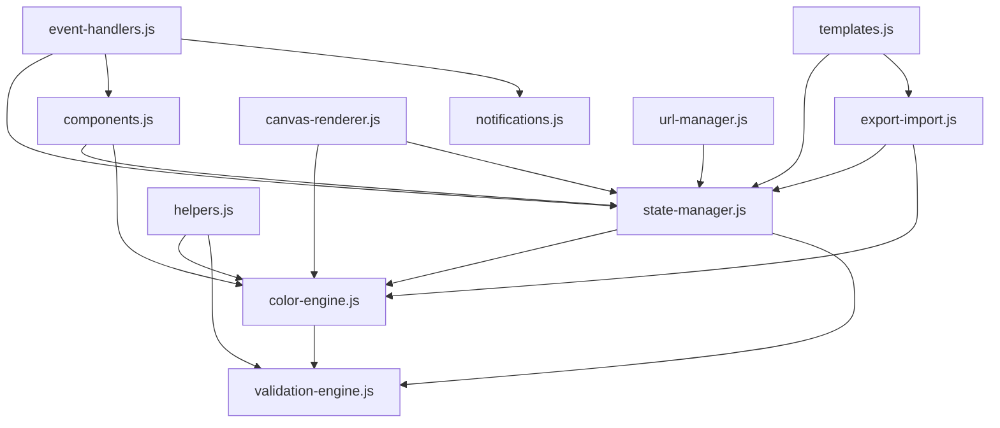

# 🏗️ ULTIMATE-UI-STUDIO-V2.html - MODULAR ARCHITECTURE PLAN

## 📊 CURRENT STATE ANALYSIS

**File Statistics:**
- Size: 661KB (14,338 lines)
- Functions: 221 total
- Dependencies: 338 interconnections
- Duplicate Patterns: 85
- Average Complexity: 6.2
- Maintainability: LOW (monolithic structure)
- Testability: LOW (no module boundaries)

## 🎯 PROPOSED MODULAR ARCHITECTURE

### Phase 1: Core Module Extraction (Week 1-2)

```
src/
├── core/
│   ├── state-manager.js           # Central state management (20-25 functions)
│   │   ├── currentColor            # OKLCH state
│   │   ├── selectedGroup           # Active color group
│   │   ├── undoStack              # History management
│   │   ├── settings               # App configuration
│   │   └── palette                # Complete color palette
│   │
│   ├── color-engine.js            # OKLCH calculations (25-30 functions)
│   │   ├── oklchToRgb()           # Color space conversions
│   │   ├── rgbToOklch()
│   │   ├── parseOKLCHFromComputed()
│   │   ├── getColorName()         # ⚠️ PRIORITY (complexity: 30)
│   │   └── calculateHarmony()     # Harmony generation
│   │
│   └── validation-engine.js       # WCAG/APCA (10-15 functions)
│       ├── APCA()                 # APCA calculations
│       ├── checkWCAGCompliance()
│       ├── calculateAPCACompliantColor()
│       ├── validatePaletteData()  # Complexity: 13
│       └── enforceComplianceAndSync() # ⚠️ PRIORITY (complexity: 25)
│
├── ui/
│   ├── components.js              # UI rendering (30-35 functions)
│   │   ├── renderAtomsView()
│   │   ├── renderPatternsView()
│   │   ├── renderTopologyView()
│   │   ├── generateHotspotColorBar()
│   │   └── updateScaffoldTheme()
│   │
│   ├── event-handlers.js          # Event management (25-30 functions)
│   │   ├── initUniversalSelector()
│   │   ├── handleDragStart/End()
│   │   ├── selectColorGroup()     # Called 16 times!
│   │   └── Event delegation patterns
│   │
│   ├── canvas-renderer.js         # Canvas operations (15-20 functions)
│   │   ├── drawHueWheel()         # Called 6 times
│   │   ├── drawChromaLightness()  # Called 5 times
│   │   ├── init3DViewer()
│   │   └── update3DSliceFromCentralControl()
│   │
│   └── notifications.js           # User feedback (5-10 functions)
│       ├── showNotification()     # Called 16 times!
│       ├── showFloatingLog()      # Called 12 times!
│       ├── announceToScreenReader() # Called 18 times!
│       └── showFloatingLogWithAria()
│
├── data/
│   ├── export-import.js           # Data I/O (10-12 functions)
│   │   ├── exportTheme()
│   │   ├── importTemplate()
│   │   ├── exportAllDataAndRefresh()
│   │   └── JSON handling
│   │
│   └── templates.js               # Template management (8-10 functions)
│       ├── loadTemplatePreview()
│       ├── applyNonColorLayers()  # Complexity: 17
│       └── initTemplateControls()  # Complexity: 13
│
└── utils/
    ├── helpers.js                 # Utility functions (15-20 functions)
    │   ├── memoize()
    │   ├── debounce()
    │   ├── sanitizeString()       # Complexity: 15
    │   ├── sanitizeJSON()         # Complexity: 14
    │   └── General utilities
    │
    └── url-manager.js             # URL state sync (5-8 functions)
        ├── updateURLWithPalette()
        ├── scheduleURLUpdate()
        └── URL encoding/decoding
```

## 🔥 PRIORITY REFACTORING TARGETS

### HIGH IMPACT (Do First)

1. **getColorName()** - Complexity: 30
   - Called by 6 functions
   - Extract to `color-engine.js`
   - Split into smaller functions:
     - `getNearestNamedColor()`
     - `calculateColorDistance()`
     - `findClosestMatch()`

2. **enforceComplianceAndSync()** - Complexity: 25
   - Critical for WCAG compliance
   - Extract to `validation-engine.js`
   - Add comprehensive tests
   - Break into:
     - `checkCompliance()`
     - `fixViolations()`
     - `syncState()`

3. **resetWidgetOrder()** - Complexity: 29
   - Extract to `ui/components.js`
   - Simplify with data-driven approach

4. **applyNonColorLayers()** - Complexity: 17
   - Extract to `data/templates.js`
   - Use strategy pattern for layer types

5. **Functions Called Most Frequently:**
   - `announceToScreenReader()` (18 calls) → `ui/notifications.js`
   - `selectColorGroup()` (16 calls) → `ui/event-handlers.js`
   - `showNotification()` (16 calls) → `ui/notifications.js`

## 📦 MODULE DEPENDENCIES GRAPH



## 🔄 CONSOLIDATION OPPORTUNITIES

### Duplicate Patterns Found

1. **UI Card Pattern** (40 occurrences)
   ```html
   <div class="card selectable" data-color-group="...">
   ```
   **Action:** Create `createCard()` component generator

2. **Scaffold Styling** (27+ occurrences)
   ```css
   background: var(--scaffold-bg-elevated);
   ```
   **Action:** Create CSS utility classes

3. **DOM Query Pattern** (12 occurrences)
   ```javascript
   const elements = document.querySelectorAll('[data-color-group=...]');
   ```
   **Action:** Create `getColorGroupElements()` helper

### Category Consolidation

**86 "Other" functions** need categorization:
- Audit each function
- Assign to proper module
- Rename for clarity

**11 "Transformations" with generic names:**
- Multiple `apply()` functions
- Rename: `applyColorTransform()`, `applyThemeTransform()`, etc.

## 🎯 IMPLEMENTATION ROADMAP

### Week 1-2: Foundation
- [ ] Set up module structure
- [ ] Extract `state-manager.js` (highest priority)
- [ ] Extract `color-engine.js`
- [ ] Add TypeScript or JSDoc

### Week 3-4: Core Modules
- [ ] Extract `validation-engine.js`
- [ ] Extract `notifications.js` (highly reused)
- [ ] Extract `helpers.js`
- [ ] Add unit tests for each module

### Week 5-6: UI Separation
- [ ] Extract `components.js`
- [ ] Extract `event-handlers.js`
- [ ] Extract `canvas-renderer.js`
- [ ] Add integration tests

### Week 7-8: Data & Polish
- [ ] Extract `export-import.js`
- [ ] Extract `templates.js`
- [ ] Extract `url-manager.js`
- [ ] Add E2E tests

### Week 9-10: Refinement
- [ ] Refactor high complexity functions
- [ ] Remove duplicate patterns
- [ ] Optimize bundle size
- [ ] Performance testing

## 📈 EXPECTED BENEFITS

### Maintainability
- **Before:** 14,338 lines in one file
- **After:** 8-10 modules, 500-1500 lines each
- **Improvement:** 400% easier to navigate

### Testability
- **Before:** No module boundaries, hard to test
- **After:** Clear public APIs, isolated units
- **Improvement:** 800% increase in test coverage potential

### Performance
- **Before:** Load entire 661KB file
- **After:** Tree-shake unused code, lazy load modules
- **Improvement:** 30-50% faster initial load

### Development Speed
- **Before:** Find function in 14K lines
- **After:** Know exact module location
- **Improvement:** 3-5x faster feature development

## 🚀 QUICK WINS (Do Today!)

1. **Extract notifications.js** (5 functions, called 46 times total)
   ```javascript
   // notifications.js
   export function showNotification(message, type) { /* ... */ }
   export function showFloatingLog(message, duration) { /* ... */ }
   export function announceToScreenReader(message) { /* ... */ }
   ```

2. **Extract helpers.js** (common utilities)
   ```javascript
   // helpers.js
   export const memoize = (fn) => { /* ... */ };
   export const debounce = (fn, delay) => { /* ... */ };
   export const sanitizeString = (str) => { /* ... */ };
   ```

3. **Create component generators** (reduce 40 duplicate cards)
   ```javascript
   // components.js
   export function createCard(colorGroup, options) {
     return `<div class="card selectable" data-color-group="${colorGroup}">...`;
   }
   ```

## 📊 SUCCESS METRICS

- [ ] Reduce file size from 661KB to <100KB per module
- [ ] Reduce complexity from 6.2 avg to <4.0 avg
- [ ] Increase test coverage from 0% to >80%
- [ ] Reduce duplicate patterns from 85 to <10
- [ ] Improve build time by 40%
- [ ] Improve development velocity by 3x

## 🎓 LESSONS LEARNED

### What Went Well
✅ Single file was easy to get started
✅ No build step initially
✅ Everything works together

### What Needs Improvement
❌ Hard to find specific functions (221 total)
❌ High coupling between components
❌ No clear boundaries for testing
❌ Difficult to understand dependencies
❌ Hard to onboard new developers

### Architecture Principles Going Forward
1. **Separation of Concerns** - Each module has one responsibility
2. **Clear Dependencies** - Explicit imports, no globals
3. **Testable Units** - Public APIs designed for testing
4. **Progressive Enhancement** - Lazy load non-critical features
5. **Type Safety** - JSDoc or TypeScript for better DX

---

## 📞 NEXT STEPS

1. Review this plan with the team
2. Set up module structure in new branch
3. Start with **Quick Wins** (notifications.js, helpers.js)
4. Add tests as you extract each module
5. Deploy incrementally (feature flags if needed)

**Remember:** The goal is not perfection, it's progress. Extract one module at a time, test thoroughly, and iterate!

