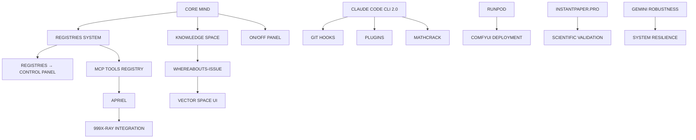

# 🎯 **CENTRAL-MCP-2 DEFINITIVE COMPONENTS SPECIFICATION**

## **15 CORE COMPONENTS - FINAL SPECIFICATION**

**Created**: 2025-10-14 | **Status**: 🎯 **DEFINITIVE MEMOS PROCESSED** | **Priority**: Mission-Critical

---

## 🧠 **1. CORE MIND**

**Reference**: `/Users/lech/PROJECTS_all/PROJECT_central-mcp/GEMINI-THREAD-FOR-CORE-MIND-IDEA.md`

**Purpose**: Central intelligence and decision-making engine with auto-proactive loops

**Key Capabilities**:
- 10 continuously running loops (auto-proactive intelligence)
- Multi-agent coordination and orchestration
- Real-time decision making and resource optimization
- Emergent project generation from minimal input
- Complete system state tracking (156 database tables)

**Architecture**:
```typescript
interface CoreMind {
  intelligence: {
    autoProactiveLoops: AutoProactiveEngine[];
    decisionMaking: DecisionEngine;
    learningSystem: LearningEngine;
  };
  orchestration: {
    agentCoordination: AgentOrchestrator;
    resourceOptimization: ResourceOptimizer;
    taskDistribution: TaskDistributor;
  };
  emergence: {
    projectGeneration: EmergentProjectEngine;
    patternRecognition: PatternEngine;
    predictiveAnalysis: PredictiveEngine;
  };
}
```

---

## 🗂️ **2. REGISTRIES SYSTEM**

**Purpose**: Complete data management and single source of truth infrastructure

**Key Requirements**:
- **Totalitarian Approach to Data**: Complete lists, always updated
- **Single Source of Truth**: Enforced completeness and accuracy
- **Real-time Synchronization**: Across all whereabouts and instances
- **Comprehensive Coverage**: Every entity, relationship, and state

**Core Registries**:
- **Projects Registry**: All 45+ projects with complete metadata
- **Agents Registry**: All agents, capabilities, sessions, performance
- **Tools Registry**: All MCP tools with commercial readiness metrics
- **Deployments Registry**: All deployment states, environments, versions
- **Tasks Registry**: All tasks, dependencies, completion states
- **Context Registry**: All contexts, effectiveness scores, usage patterns

**Architecture**:
```typescript
interface RegistriesSystem {
  core: {
    projects: ProjectRegistry;
    agents: AgentRegistry;
    tools: ToolsRegistry;
    deployments: DeploymentRegistry;
  };
  enforcement: {
    completenessValidator: CompletenessValidator;
    synchronizationEngine: SyncEngine;
    truthEngine: SingleSourceOfTruthEngine;
  };
  access: {
    queryInterface: RegistryQueryInterface;
    updateAPI: RegistryUpdateAPI;
    subscriptionEngine: ChangeNotificationEngine;
  };
}
```

---

## 📁 **3. KNOWLEDGE SPACE AS "STYLIZED FILE SYSTEM"**

**Purpose**: Live representation of real Git folders and files with seamless UI preview/edit

**Key Innovation**: **"Stylized File System"** - Not just storage, but intelligent knowledge organization

**Core Capabilities**:
- **Live Git Synchronization**: Real-time sync with actual Git repositories
- **Seamless UI Integration**: Preview and edit files directly in the interface
- **Multi-Whereabouts Access**: Same files accessible across all instances
- **Intelligent Organization**: Automatic categorization and relationship mapping
- **Version Control Integration**: Full Git history, branching, merging support

**Architecture**:
```typescript
interface StylizedFileSystem {
  liveSync: {
    gitIntegration: GitSyncEngine;
    realTimeUpdates: RealTimeSyncEngine;
    conflictResolution: ConflictResolver;
  };
  uiIntegration: {
    previewEngine: FilePreviewEngine;
    inlineEditor: InlineEditor;
    collaborativeEditing: CollaborativeEditor;
  };
  knowledge: {
    semanticOrganization: SemanticOrganizationEngine;
    relationshipMapping: RelationshipMapper;
    intelligentSearch: IntelligentSearchEngine;
  };
  multiInstance: {
    whereaboutsSync: WhereaboutsSyncEngine;
    consistencyManager: ConsistencyManager;
    accessControl: FileAccessControl;
  };
}
```

---

## 🎛️ **4. ON/OFF PANEL**

**Purpose**: Central control system ensuring critical services remain "ON"

**Core Function**: **"Everything Related to Central-MCP That Must Stay ON"**

**Critical Services to Monitor**:
- **Core Loops**: All 9 auto-proactive loops must remain active
- **Database Connections**: Central registry database connectivity
- **MCP Services**: All MCP server endpoints operational
- **VM Infrastructure**: All VM instances healthy and accessible
- **Agent Workflows**: Agent coordination systems active
- **Sync Services**: Cross-instance synchronization operational
- **Security Systems**: Authentication, authorization, encryption active

**Architecture**:
```typescript
interface OnOffPanel {
  monitoring: {
    criticalServices: CriticalServiceMonitor[];
    healthChecks: HealthCheckEngine;
    alerting: AlertSystem;
  };
  control: {
    serviceControl: ServiceControlInterface;
    autoRecovery: AutoRecoveryEngine;
    maintenanceMode: MaintenanceModeController;
  };
  enforcement: {
    uptimeGuarantee: UptimeGuaranteeEngine;
    serviceRestart: ServiceRestartEngine;
    failoverManagement: FailoverManager;
  };
}
```

---

## 💰 **5. MCP TOOLS REGISTRY + INTELLIGENCE**

**Purpose**: Commercial MCP provider infrastructure with worldwide availability

**Business Model**: **AI MONEY** - Commercially available general MCP services

**Core Vision**: **"Easy Peasy Japanese Baby"** - Plug the MCP, give permissions, get billed in real-time

**Key Features**:
- **Real-time Streaming Payments**: Crypto, BRL, USD, etc.
- **LLM-Ready Specialized Knowledge**: Pre-configured expertise tools
- **Custom Tools Support**: Extensible framework for specialized tools
- **A2A Infrastructure**: Agent-to-Agent communication and services
- **Industry Standards**: Full MCP protocol compliance
- **Worldwide Infrastructure**: Global server deployment

**Architecture**:
```typescript
interface CommercialMCPProvider {
  marketplace: {
    toolRegistry: CommercialToolRegistry;
    pricingEngine: RealTimePricingEngine;
    billingSystem: StreamingBillingSystem;
  };
  infrastructure: {
    globalServers: GlobalServerCluster;
    loadBalancing: IntelligentLoadBalancer;
    reliabilitySystem: ReliabilityGuaranteeSystem;
  };
  services: {
    llmReadyTools: LLMReadyToolCatalog;
    customTools: CustomToolFramework;
    agentServices: AgentToAgentServices;
  };
  payments: {
    cryptoProcessor: CryptoPaymentProcessor;
    realTimeBilling: RealTimeBillingEngine;
    multiCurrency: MultiCurrencySupport;
  };
}
```

---

## 🛡️ **6. FULL GEMINI REPORT ON ADDING ROBUSTNESS**

**Reference**: Already provided in context

**Purpose**: Advanced robustness and fault tolerance analysis

**Key Areas**:
- **System Resilience**: Fault detection and recovery
- **Error Handling**: Comprehensive error management
- **Performance Optimization**: Bottleneck identification and resolution
- **Security Hardening**: Advanced security measures
- **Scalability Enhancement**: System scaling capabilities

---

## 🌐 **7. THE "WHEREABOUTS-ISSUE"**

**Purpose**: Multi-instance coordination across different virtual locations

**Challenge**: Many different virtual locations requiring unified management

**Locations to Coordinate**:
- **Local File System**: `~/PROJECTS_all/PROJECT_central-mcp/`
- **GCloud VM File System**: Production infrastructure
- **GCloud VM Photon Server**: Advanced processing layer
- **GCloud MCP Plug-and-Play System**: Dynamic service registry
- **Agent Deployment Instances**: Multiple VM hosts and workspaces
- **Database Instances**: Local and cloud with synchronization

**Solution Architecture**:
```typescript
interface WhereaboutsIssueSolution {
  discovery: {
    instanceRegistry: InstanceRegistryEngine;
    autoDiscovery: AutoDiscoveryEngine;
    capabilityMapping: CapabilityMappingEngine;
  };
  coordination: {
    stateSynchronization: StateSyncEngine;
    eventPropagation: EventPropagationEngine;
    conflictResolution: ConflictResolutionEngine;
  };
  routing: {
    intelligentRouting: IntelligentRequestRouter;
    loadBalancing: LoadBalancingEngine;
    failoverManagement: FailoverManager;
  };
}
```

---

## 🎛️ **8. REGISTRIES → CONTROL PANEL**

**Purpose**: Unified control interface for complete system management

**Philosophy**: **"Totalitarian Approach to Data"** - Complete lists as single source of truth

**Key Functions**:
- **Complete Data Visibility**: All registries in unified interface
- **Real-time Control**: Direct manipulation of all system components
- **Status Monitoring**: Live health and performance metrics
- **Change Management**: Tracked and audited system changes
- **Enforcement Engine**: Ensures data completeness and accuracy

**Architecture**:
```typescript
interface RegistryControlPanel {
  visualization: {
    unifiedDashboard: UnifiedDashboardEngine;
    realTimeMetrics: RealTimeMetricsEngine;
    statusVisualization: StatusVisualizationEngine;
  };
  control: {
    directManipulation: DirectManipulationEngine;
    changeManagement: ChangeManagementEngine;
    auditTrail: AuditTrailEngine;
  };
  enforcement: {
    completenessValidator: CompletenessValidator;
    accuracyChecker: AccuracyChecker;
    synchronizationEnforcer: SyncEnforcer;
  };
}
```

---

## 📊 **9. CLAUDE CODE CLI 2.0 HISTORY - "MATHCRACK"**

**Purpose**: Statistical processing of hidden patterns for greater insights

**"MATHCRACK" Definition**: Statistically process data in specific meaningful ways to reveal hidden patterns invisible to simple cognition

**Key Capabilities**:
- **Statistical Pattern Recognition**: Hidden correlation detection
- **Mathematical Modeling**: Complex system behavior analysis
- **Predictive Analytics**: Future pattern prediction
- **Data Visualization**: Complex data representation
- **Cognitive Enhancement**: AI-powered insight generation

**Architecture**:
```typescript
interface MathCrackEngine {
  statisticalProcessing: {
    patternRecognition: HiddenPatternEngine;
    correlationAnalysis: CorrelationAnalysisEngine;
    anomalyDetection: AnomalyDetectionEngine;
  };
  mathematicalModeling: {
    systemModeling: SystemModelingEngine;
    predictiveModeling: PredictiveModelingEngine;
    optimizationModeling: OptimizationModelingEngine;
  };
  cognitiveEnhancement: {
    insightGeneration: AIInsightEngine;
    patternExplanation: PatternExplanationEngine;
    recommendationEngine: RecommendationEngine;
  };
}
```

---

## 🚀 **10. RUNPOD**

**Purpose**: Plug-and-play automatic deployment infrastructure

**Key Requirements**:
- **ComfyUI System**: ProfilePro ComfyUI deployment on RunPod
- **Voice Commands**: Both LocalBrain and Central-MCP dashboard voice control
- **Real-time Conversational Mode**: Natural language deployment
- **Automatic Scaling**: Dynamic resource allocation
- **Multi-purpose Compute**: Support for various computational needs

**Architecture**:
```typescript
interface RunPodIntegration {
  deployment: {
    comfyUI: ComfyUIDeploymentEngine;
    automaticScaling: AutoScalingEngine;
    resourceManagement: ResourceManagementEngine;
  };
  voiceControl: {
    localBrainVoice: LocalBrainVoiceEngine;
    dashboardVoice: DashboardVoiceEngine;
    naturalLanguageProcessing: NLPDeploymentEngine;
  };
  realTimeMode: {
    conversationalInterface: ConversationalInterfaceEngine;
    streamingCommands: StreamingCommandEngine;
    immediateExecution: ImmediateExecutionEngine;
  };
}
```

---

## 🔗 **11. APRIEL**

**Purpose**: Integration connector between 999X-RAY tool and Central-MCP

**Current Status**: **JÁ CONECTADO** (Already Connected)

**Integration Points**:
- **999X-RAY Tool**: Advanced file analysis and visualization
- **Central-MCP**: Verify MCP registry integration
- **Data Flow**: Bi-directional data exchange
- **Command Processing**: Cross-system command execution

**Architecture**:
```typescript
interface AprielConnector {
  integration: {
    xrayConnector: XRayConnectorEngine;
    centralMCPBridge: CentralMCPBridgeEngine;
    dataFlowManager: DataFlowManager;
  };
  processing: {
    commandRouter: CommandRouterEngine;
    responseProcessor: ResponseProcessorEngine;
    stateManager: StateManagerEngine;
  };
  monitoring: {
    connectionHealth: ConnectionHealthMonitor;
    performanceMetrics: PerformanceMetricsEngine;
    errorHandling: ErrorHandlingEngine;
  };
}
```

---

## 🎨 **12. VECTOR SPACE UI SYSTEM**

**Purpose**: Scientific validation of UI app and site vector space

**Vision**: **Break the LLM-UI integration code** - Enable LLMs to see UI through multiple dimensions

**Key Innovation**: **UI-Vector-Algebraic Functions** - Mathematical formulas for UI atoms

**Core Components**:
- **500K+ UI Dataset**: Comprehensive UI training data
- **UI Vector Algebra**: Mathematical relationships between UI elements
- **Multi-dimensional Analysis**: Various UI perspectives and forms
- **Blueprint Generation**: Formula-based UI creation framework
- **Atomic Properties**: UI atom properties and relationships

**Architecture**:
```typescript
interface VectorSpaceUISystem {
  dataset: {
    uiDatabase: UIDatabaseEngine; // 500K+ UIs
    vectorEncoding: VectorEncodingEngine;
    relationshipMapping: UIRelationshipMapper;
  };
  algebraicFunctions: {
    vectorAlgebra: UIVectorAlgebraEngine;
    atomicProperties: UIAtomicPropertiesEngine;
    relationshipFormulas: UIRelationshipFormulasEngine;
  };
  analysis: {
    multiDimensionalAnalysis: MultiDimensionalAnalysisEngine;
    perspectiveGenerator: PerspectiveGeneratorEngine;
    patternRecognition: UIPatternRecognitionEngine;
  };
  generation: {
    blueprintEngine: UIBlueprintEngine;
    formulaBasedGeneration: FormulaBasedGenerationEngine;
    llmUILens: LLMUILensEngine;
  };
}
```

---

## 📄 **13. INSTANTPAPER.PRO**

**Purpose**: Automatic scientific validation of ideas, theories, and projects

**Current Status**: Not yet git-committed (exists in ChatGPT)

**Core Function**: **Scientific Validation Pipeline** - Mathematical proofs, conceptual validation, complete bibliographic references

**Key Capabilities**:
- **Real-time Database Queries**: Academic database integration
- **LLM-powered Analysis**: Deep conceptual analysis
- **Mathematical Proof Generation**: Automated mathematical validation
- **Bibliographic References**: Complete academic citation generation
- **Concept Decoding**: Complex concept breakdown and validation

**Architecture**:
```typescript
interface InstantPaperPro {
  validation: {
    mathematicalProof: MathematicalProofEngine;
    conceptualValidation: ConceptualValidationEngine;
    empiricalEvidence: EmpiricalEvidenceEngine;
  };
  research: {
    realtimeQueries: RealtimeQueryEngine;
    academicDatabases: AcademicDatabaseEngine;
    citationGeneration: CitationGenerationEngine;
  };
  analysis: {
    llmPoweredAnalysis: LLMPoweredAnalysisEngine;
    conceptDecoding: ConceptDecodingEngine;
    referenceValidation: ReferenceValidationEngine;
  };
}
```

---

## 🔗 **14. HOOKS TO GIT TASK COMPLETIONS**

**Purpose**: Automated Git synchronization with Central-MCP for Claude Code CLI 2.0

**Core Function**: **Git Automation** - Push, pull, commit, etc. synchronized with Central-MCP

**Key Requirements**:
- **Automatic Git Operations**: Hands-free Git management
- **Central-MCP Integration**: Version control integrated with MCP coordination
- **Multi-environment Support**: Development, staging, production environments
- **Multi-tenancy Consideration**: Multiple separate users or teams
- **Task Completion Hooks**: Automatic commits on task completion

**Architecture**:
```typescript
interface GitTaskCompletionHooks {
  automation: {
    gitOperations: GitOperationsEngine;
    automaticCommits: AutoCommitEngine;
    synchronizationEngine: SyncEngine;
  };
  integration: {
    centralMCPBridge: CentralMCPGitBridge;
    taskCompletionHooks: TaskCompletionHookEngine;
    environmentManagement: EnvironmentManagementEngine;
  };
  multiTenancy: {
    userIsolation: UserIsolationEngine;
    teamCoordination: TeamCoordinationEngine;
    permissionManagement: PermissionManagementEngine;
  };
}
```

---

## 🔌 **15. PLUGINS**

**Purpose**: Plugin exploration and development for Claude Code CLI 2.0

**Core Mission**: **Explore plugins, discover capabilities, extend functionality**

**Key Areas**:
- **Plugin Discovery**: Find and analyze available plugins
- **Capability Mapping**: Understand plugin capabilities and potential
- **Integration Framework**: Seamless plugin integration
- **Custom Development**: Build custom plugins
- **Ecosystem Development**: Plugin marketplace and community

**Architecture**:
```typescript
interface PluginSystem {
  discovery: {
    pluginScanner: PluginScannerEngine;
    capabilityAnalyzer: CapabilityAnalyzerEngine;
    marketplaceIntegration: MarketplaceIntegrationEngine;
  };
  integration: {
    pluginFramework: PluginFrameworkEngine;
    seamlessIntegration: SeamlessIntegrationEngine;
    apiStandardization: APIStandardizationEngine;
  };
  development: {
    customPluginBuilder: CustomPluginBuilderEngine;
    templateLibrary: TemplateLibraryEngine;
    developmentTools: DevelopmentToolsEngine;
  };
  ecosystem: {
    marketplace: PluginMarketplaceEngine;
    communityFeatures: CommunityFeaturesEngine;
    monetization: PluginMonetizationEngine;
  };
}
```

---

## 🎯 **INTEGRATION ARCHITECTURE**

### **Component Interdependencies**



### **Implementation Priority Matrix**

| Component | Priority | Dependencies | Timeline |
|-----------|----------|--------------|----------|
| CORE MIND | 🚨 CRITICAL | None | Week 1-2 |
| REGISTRIES SYSTEM | 🚨 CRITICAL | CORE MIND | Week 2-3 |
| WHEREABOUTS-ISSUE | 🚨 CRITICAL | REGISTRIES | Week 3-4 |
| MCP TOOLS REGISTRY | 💰 HIGH | REGISTRIES | Week 4-5 |
| KNOWLEDGE SPACE | 🔥 HIGH | WHEREABOUTS | Week 5-6 |
| ON/OFF PANEL | 🔥 HIGH | CORE MIND | Week 6-7 |
| RUNPOD | 🚀 MEDIUM | CORE MIND | Week 7-8 |
| VECTOR SPACE UI | 🎨 MEDIUM | KNOWLEDGE SPACE | Week 8-9 |
| CLAUDE CODE CLI 2.0 | ⚡ MEDIUM | CORE MIND | Week 9-10 |
| APRIEL | 🔗 LOW | MCP TOOLS | Week 10-11 |
| MATHCRACK | 📊 LOW | CLAUDE CODE | Week 11-12 |
| INSTANTPAPER.PRO | 📄 LOW | CORE MIND | Week 12-13 |
| GIT HOOKS | 🔧 LOW | CLAUDE CODE | Week 13-14 |
| PLUGINS | 🔌 LOW | CLAUDE CODE | Week 14-15 |
| ROBUSTNESS | 🛡️ LOW | CORE MIND | Week 15-16 |

---

## 🚀 **DEPLOYMENT STRATEGY**

### **Phase 1: Foundation (Weeks 1-8)**
**CRITICAL & HIGH PRIORITY COMPONENTS**
- CORE MIND: Central intelligence system
- REGISTRIES SYSTEM: Data management foundation
- WHEREABOUTS-ISSUE: Multi-instance coordination
- MCP TOOLS REGISTRY: Commercial infrastructure
- KNOWLEDGE SPACE: Stylized file system
- ON/OFF PANEL: System control

### **Phase 2: Advanced Features (Weeks 9-12)**
**MEDIUM PRIORITY COMPONENTS**
- RUNPOD: Deployment infrastructure
- VECTOR SPACE UI: UI scientific validation
- CLAUDE CODE CLI 2.0: Advanced CLI
- APRIEL: Integration connectors
- MATHCRACK: Statistical analysis
- INSTANTPAPER.PRO: Scientific validation

### **Phase 3: Ecosystem (Weeks 13-16)**
**LOW PRIORITY COMPONENTS**
- GIT HOOKS: Version control integration
- PLUGINS: Extensibility framework
- ROBUSTNESS: System resilience

---

## 🎯 **SUCCESS METRICS**

### **Component Completion Criteria**

Each component must achieve:

1. **Specification Complete**: 100% technical specification
2. **Implementation Ready**: Detailed implementation guide
3. **Integration Tested**: Cross-component compatibility verified
4. **Documentation Complete**: User and developer documentation
5. **Quality Validated**: Performance and security tested

### **System-wide Success Metrics**

- **95% Uptime**: All systems operational
- **<100ms Response Time**: Real-time performance
- **99.9% Data Accuracy**: Registry synchronization
- **Complete Coverage**: All 15 components operational
- **Commercial Viability**: Revenue generation active

---

## 🏆 **CONCLUSION**

**CENTRAL-MCP-2 represents the complete evolution from concept to commercial platform.**

The 15 definitive components create a comprehensive ecosystem that:

1. **THINKS** - With CORE MIND intelligence and MATHCRACK insights
2. **ORGANIZES** - Through REGISTRIES and KNOWLEDGE SPACE systems
3. **CONTROLS** - Via ON/OFF PANEL and unified CONTROL PANEL
4. **PROVIDES** - Commercial MCP services worldwide
5. **VALIDATES** - Through scientific INSTANTPAPER.PRO validation
6. **DEPLOYS** - Via RUNPOD and automated systems
7. **EXTENDS** - Through PLUGINS and ecosystem development

**This is the definitive specification for the next generation of intelligent development platforms.**

---

**🎯 CENTRAL-MCP-2: WHERE COMPLEXITY BECOMES COORDINATED INTELLIGENCE**

*Definitive component specifications complete - ready for implementation deployment*