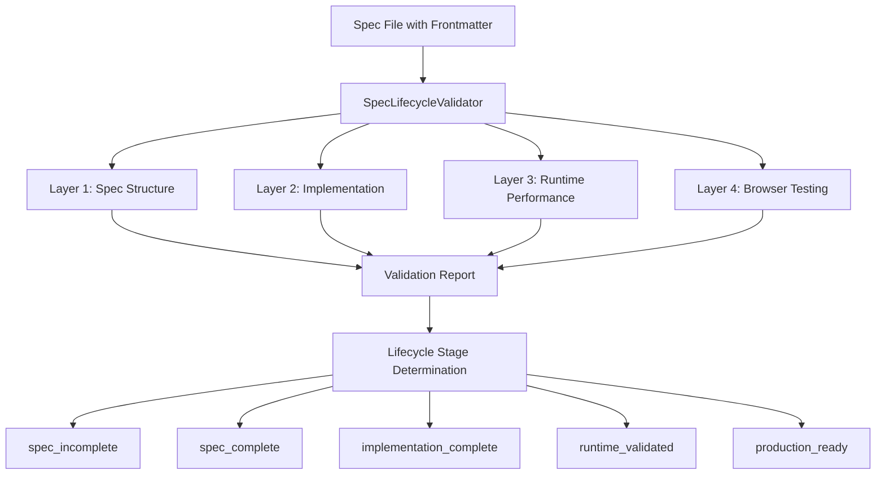

# SPEC_0020: Example Spec with Complete Validation Criteria

## Overview

This is an **EXAMPLE SPECIFICATION** demonstrating how to use frontmatter-based validation criteria to create an EXECUTABLE CONTRACT for your project lifecycle.

### Key Innovation

Instead of subjective "definition of done" in prose, we define **OBJECTIVE, DETERMINISTIC validation criteria** in YAML frontmatter that can be automatically tested by the `SpecLifecycleValidator`.

### Validation Approach

**4-Layer Validation Architecture:**

1. **Spec Structure** → Is this spec document complete?
2. **Implementation** → Does code exist and match requirements?
3. **Runtime Performance** → Does it meet performance targets?
4. **Browser Testing** → Does user experience work correctly?

### Benefits

- ✅ **Objective validation** - No subjective judgment
- ✅ **Deterministic testing** - Same results every time
- ✅ **Complete lifecycle coverage** - From spec → production
- ✅ **Automatic validation** - No manual checking needed
- ✅ **Git integration** - Validation tied to commits
- ✅ **Performance enforcement** - Targets are REQUIRED, not optional

---

## Technical Architecture

### System Components



### Validation Pipeline

```
Spec File
  ↓
Parse Frontmatter
  ↓
Execute Layer 1 (Spec Structure)
  ↓ (if passed)
Execute Layer 2 (Implementation)
  ↓ (if passed)
Execute Layer 3 (Runtime Performance)
  ↓ (if passed)
Execute Layer 4 (Browser Testing)
  ↓
Generate Validation Report
  ↓
Determine Lifecycle Stage
  ↓
Update Git Intelligence
```

---

## Implementation Requirements

### Required Files

1. **Service Layer** (`src/example/ExampleService.ts`)
   - Core business logic
   - Data validation
   - Error handling

2. **API Layer** (`src/example/ExampleAPI.ts`)
   - HTTP endpoints
   - Request validation
   - Response formatting

3. **Type Definitions** (`src/example/types.ts`)
   - TypeScript interfaces
   - Validation schemas
   - API contracts

### Required Functions

```typescript
// Create new example
async function createExample(data: ExampleInput): Promise<Example>

// Update existing example
async function updateExample(id: string, data: Partial<ExampleInput>): Promise<Example>

// Delete example
async function deleteExample(id: string): Promise<void>

// Retrieve example
async function getExample(id: string): Promise<Example>
```

### Required Tests

- Unit tests for service layer
- Integration tests for API layer
- Minimum 80% code coverage

### Git Requirements

- At least 5 commits implementing the feature
- All commits must use conventional commit format
- Commit messages must reference this spec ID (SPEC_0020)

---

## Success Criteria

### Layer 1: Spec Complete ✅

- All required sections present
- Word count between 800-3000 words
- System architecture diagram included
- Data flow diagram included

### Layer 2: Implementation Complete ✅

- All required files exist
- All required tests written
- Test coverage ≥ 80%
- All functions implemented
- Conventional commits used

### Layer 3: Runtime Validated ✅

- API response time < 200ms
- Database query time < 50ms
- Memory usage < 512 MB
- Error rate < 1%
- Throughput ≥ 100 rps
- Health check passing
- Load test passing (100 concurrent users)

### Layer 4: Production Ready ✅

- Dashboard loads in < 2 seconds
- All required UI elements present
- Create example flow works end-to-end
- View example flow works end-to-end
- Performance check passes

---

## API Specifications

### POST /api/examples

Create new example.

**Request:**
```json
{
  "name": "Example Name",
  "description": "Example description"
}
```

**Response:**
```json
{
  "id": "uuid",
  "name": "Example Name",
  "description": "Example description",
  "created_at": "2025-10-11T00:00:00Z"
}
```

### GET /api/examples/:id

Retrieve example by ID.

**Response:**
```json
{
  "id": "uuid",
  "name": "Example Name",
  "description": "Example description",
  "created_at": "2025-10-11T00:00:00Z",
  "updated_at": "2025-10-11T00:00:00Z"
}
```

---

## Database Schema

```sql
CREATE TABLE examples (
  id UUID PRIMARY KEY DEFAULT gen_random_uuid(),
  name VARCHAR(255) NOT NULL,
  description TEXT,
  created_at TIMESTAMP DEFAULT NOW(),
  updated_at TIMESTAMP DEFAULT NOW()
);
```

---

## Related Specs

- [SPEC_0010: Auto-Proactive Intelligence](./0010_AUTO_PROACTIVE_INTELLIGENCE_ARCHITECTURE.md)
- [SPEC_0013: User Message Intelligence](./0013_USER_MESSAGE_INTELLIGENCE_SYSTEM.md)
- [SPEC_0015: Complete Idea Lifecycle](./0015_COMPLETE_IDEA_LIFECYCLE_ARCHITECTURE.md)

---

## Validation History

**2025-10-11:** Initial spec created with complete validation criteria.

---

## Notes

This spec demonstrates the COMPLETE validation system:

1. **Frontmatter as Contract** - YAML defines objective success criteria
2. **4-Layer Validation** - Covers entire project lifecycle
3. **Automatic Testing** - No manual validation needed
4. **Git Integration** - Tied to commit history
5. **Performance Enforcement** - Targets are REQUIRED

This transforms specs from **documentation** → **EXECUTABLE CONTRACTS**!
