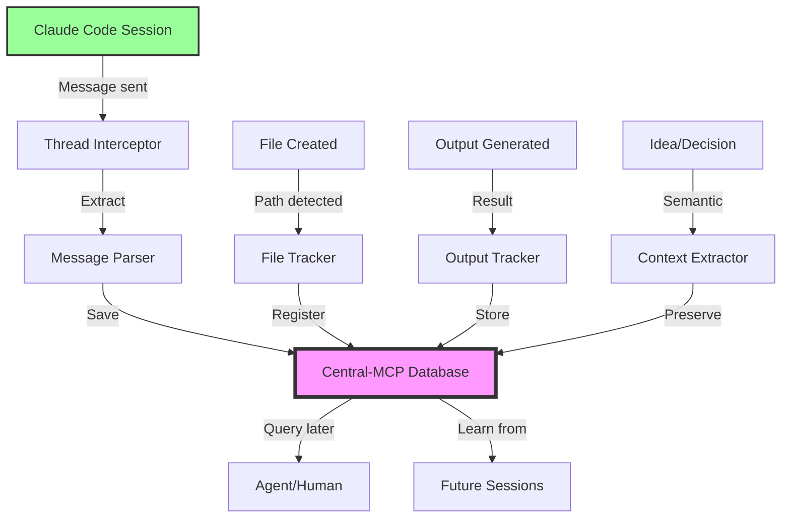

# 🧵 THREAD AUTO-SAVE SYSTEM - Never Lose Context!
## Automatic Conversation Preservation in Central-MCP
**Date**: 2025-10-09
**Priority**: CRITICAL
**Purpose**: Save all Claude Code conversations, ideas, file paths, outputs to Central-MCP

---

## 🎯 THE PROBLEM

**Current Reality:**
- Claude Code conversations happen in terminal
- When session ends, all context is lost
- Ideas, file paths, outputs disappear
- No institutional memory of conversations
- Agents can't learn from past discussions

**Impact:**
- Lost productivity (re-explaining same concepts)
- Lost ideas (brilliant insights disappear)
- Lost file paths (where did I save that?)
- Lost outputs (what was the solution?)
- No agent learning across sessions

---

## 💡 THE SOLUTION: THREAD AUTO-SAVE SYSTEM

### **Automatic Conversation Preservation:**

```
EVERY Claude Code message → Saved to Central-MCP database
EVERY file created → Path + content saved
EVERY output generated → Result saved
EVERY idea discussed → Captured in context
EVERY decision made → Preserved institutionally
```

### **Architecture:**



---

## 🗄️ DATABASE SCHEMA

### **Conversations Table:**
```sql
CREATE TABLE conversations (
  id TEXT PRIMARY KEY,
  agent_id TEXT NOT NULL,
  project_id TEXT,
  started_at TEXT NOT NULL,
  ended_at TEXT,
  message_count INTEGER DEFAULT 0,
  files_created INTEGER DEFAULT 0,
  ideas_captured INTEGER DEFAULT 0,
  metadata TEXT, -- JSON: { model, context_window, session_type }
  FOREIGN KEY (agent_id) REFERENCES agents(id),
  FOREIGN KEY (project_id) REFERENCES projects(id)
);

CREATE INDEX idx_conversations_agent ON conversations(agent_id);
CREATE INDEX idx_conversations_project ON conversations(project_id);
CREATE INDEX idx_conversations_started ON conversations(started_at);
```

### **Messages Table:**
```sql
CREATE TABLE messages (
  id TEXT PRIMARY KEY,
  conversation_id TEXT NOT NULL,
  role TEXT NOT NULL CHECK(role IN ('human', 'assistant', 'system')),
  content TEXT NOT NULL,
  timestamp TEXT NOT NULL DEFAULT (datetime('now')),
  metadata TEXT, -- JSON: { tokens, files_referenced, ideas_mentioned }
  FOREIGN KEY (conversation_id) REFERENCES conversations(id)
);

CREATE INDEX idx_messages_conversation ON messages(conversation_id);
CREATE INDEX idx_messages_timestamp ON messages(timestamp);
CREATE INDEX idx_messages_role ON messages(role);
```

### **File Tracking Table:**
```sql
CREATE TABLE conversation_files (
  id TEXT PRIMARY KEY,
  conversation_id TEXT NOT NULL,
  file_path TEXT NOT NULL,
  action TEXT NOT NULL CHECK(action IN ('created', 'read', 'edited', 'deleted')),
  content_snapshot TEXT, -- Full content at time of action
  timestamp TEXT NOT NULL DEFAULT (datetime('now')),
  metadata TEXT, -- JSON: { lines, bytes, type }
  FOREIGN KEY (conversation_id) REFERENCES conversations(id)
);

CREATE INDEX idx_conv_files_conversation ON conversation_files(conversation_id);
CREATE INDEX idx_conv_files_path ON conversation_files(file_path);
CREATE INDEX idx_conv_files_action ON conversation_files(action);
```

### **Ideas/Decisions Table:**
```sql
CREATE TABLE conversation_ideas (
  id TEXT PRIMARY KEY,
  conversation_id TEXT NOT NULL,
  idea_type TEXT NOT NULL CHECK(idea_type IN ('insight', 'decision', 'solution', 'question', 'blocker')),
  content TEXT NOT NULL,
  context TEXT, -- Surrounding conversation context
  tags TEXT, -- JSON array: ['architecture', 'performance', 'security']
  timestamp TEXT NOT NULL DEFAULT (datetime('now')),
  FOREIGN KEY (conversation_id) REFERENCES conversations(id)
);

CREATE INDEX idx_ideas_conversation ON conversation_ideas(conversation_id);
CREATE INDEX idx_ideas_type ON conversation_ideas(idea_type);
CREATE INDEX idx_ideas_timestamp ON conversation_ideas(timestamp);
```

### **Outputs Table:**
```sql
CREATE TABLE conversation_outputs (
  id TEXT PRIMARY KEY,
  conversation_id TEXT NOT NULL,
  output_type TEXT NOT NULL CHECK(output_type IN ('code', 'spec', 'diagram', 'analysis', 'solution')),
  content TEXT NOT NULL,
  file_path TEXT, -- If output was saved to file
  timestamp TEXT NOT NULL DEFAULT (datetime('now')),
  metadata TEXT, -- JSON: { language, lines, validation_score }
  FOREIGN KEY (conversation_id) REFERENCES conversations(id)
);

CREATE INDEX idx_outputs_conversation ON conversation_outputs(conversation_id);
CREATE INDEX idx_outputs_type ON conversation_outputs(output_type);
CREATE INDEX idx_outputs_file ON conversation_outputs(file_path);
```

---

## 🔌 IMPLEMENTATION

### **Thread Interceptor (Hooks into Claude Code):**

```typescript
/**
 * Thread Interceptor - Captures all Claude Code conversation activity
 */
export class ThreadInterceptor {
  private db: Database;
  private currentConversationId: string;

  constructor(db: Database, agentId: string, projectId?: string) {
    this.db = db;
    this.currentConversationId = this.initializeConversation(agentId, projectId);
  }

  /**
   * Initialize new conversation session
   */
  private initializeConversation(agentId: string, projectId?: string): string {
    const id = `conv_${Date.now()}_${agentId}`;

    this.db.run(`
      INSERT INTO conversations (id, agent_id, project_id, started_at)
      VALUES (?, ?, ?, datetime('now'))
    `, [id, agentId, projectId]);

    console.log(`🧵 Thread auto-save started: ${id}`);
    return id;
  }

  /**
   * Save human message
   */
  saveHumanMessage(content: string): void {
    this.saveMessage('human', content);
  }

  /**
   * Save assistant message
   */
  saveAssistantMessage(content: string, metadata?: any): void {
    this.saveMessage('assistant', content, metadata);
  }

  /**
   * Save message to database
   */
  private saveMessage(role: 'human' | 'assistant' | 'system', content: string, metadata?: any): void {
    const id = `msg_${Date.now()}_${Math.random().toString(36).substr(2, 9)}`;

    this.db.run(`
      INSERT INTO messages (id, conversation_id, role, content, metadata)
      VALUES (?, ?, ?, ?, ?)
    `, [id, this.currentConversationId, role, content, JSON.stringify(metadata || {})]);

    // Update message count
    this.db.run(`
      UPDATE conversations
      SET message_count = message_count + 1
      WHERE id = ?
    `, [this.currentConversationId]);
  }

  /**
   * Track file creation/modification
   */
  trackFile(action: 'created' | 'read' | 'edited' | 'deleted', filePath: string, content?: string): void {
    const id = `file_${Date.now()}_${Math.random().toString(36).substr(2, 9)}`;

    this.db.run(`
      INSERT INTO conversation_files (id, conversation_id, file_path, action, content_snapshot)
      VALUES (?, ?, ?, ?, ?)
    `, [id, this.currentConversationId, filePath, action, content]);

    // Update files created count
    if (action === 'created') {
      this.db.run(`
        UPDATE conversations
        SET files_created = files_created + 1
        WHERE id = ?
      `, [this.currentConversationId]);
    }

    console.log(`📁 File tracked: ${action} ${filePath}`);
  }

  /**
   * Capture idea/decision
   */
  captureIdea(type: 'insight' | 'decision' | 'solution' | 'question' | 'blocker', content: string, context?: string, tags?: string[]): void {
    const id = `idea_${Date.now()}_${Math.random().toString(36).substr(2, 9)}`;

    this.db.run(`
      INSERT INTO conversation_ideas (id, conversation_id, idea_type, content, context, tags)
      VALUES (?, ?, ?, ?, ?, ?)
    `, [id, this.currentConversationId, type, content, context, JSON.stringify(tags || [])]);

    // Update ideas count
    this.db.run(`
      UPDATE conversations
      SET ideas_captured = ideas_captured + 1
      WHERE id = ?
    `, [this.currentConversationId]);

    console.log(`💡 Idea captured: ${type}`);
  }

  /**
   * Save output
   */
  saveOutput(type: 'code' | 'spec' | 'diagram' | 'analysis' | 'solution', content: string, filePath?: string, metadata?: any): void {
    const id = `out_${Date.now()}_${Math.random().toString(36).substr(2, 9)}`;

    this.db.run(`
      INSERT INTO conversation_outputs (id, conversation_id, output_type, content, file_path, metadata)
      VALUES (?, ?, ?, ?, ?, ?)
    `, [id, this.currentConversationId, type, content, filePath, JSON.stringify(metadata || {})]);

    console.log(`📤 Output saved: ${type}`);
  }

  /**
   * End conversation session
   */
  endConversation(): void {
    this.db.run(`
      UPDATE conversations
      SET ended_at = datetime('now')
      WHERE id = ?
    `, [this.currentConversationId]);

    console.log(`🧵 Thread auto-save ended: ${this.currentConversationId}`);
  }
}
```

---

## 🔍 QUERYING SAVED THREADS

### **Find Past Conversations:**
```sql
-- Find all conversations by agent
SELECT * FROM conversations WHERE agent_id = 'B' ORDER BY started_at DESC;

-- Find conversations about specific topic
SELECT c.*
FROM conversations c
JOIN messages m ON c.id = m.conversation_id
WHERE m.content LIKE '%spec generator%'
GROUP BY c.id;

-- Find files created in conversation
SELECT * FROM conversation_files
WHERE conversation_id = 'conv_123' AND action = 'created';

-- Find ideas captured
SELECT * FROM conversation_ideas
WHERE conversation_id = 'conv_123'
ORDER BY timestamp DESC;
```

### **Reconstruct Full Conversation:**
```typescript
async function reconstructConversation(conversationId: string): Promise<ConversationReplay> {
  // Get conversation metadata
  const conversation = await db.get(`
    SELECT * FROM conversations WHERE id = ?
  `, [conversationId]);

  // Get all messages
  const messages = await db.all(`
    SELECT * FROM messages
    WHERE conversation_id = ?
    ORDER BY timestamp ASC
  `, [conversationId]);

  // Get all file actions
  const files = await db.all(`
    SELECT * FROM conversation_files
    WHERE conversation_id = ?
    ORDER BY timestamp ASC
  `, [conversationId]);

  // Get all ideas
  const ideas = await db.all(`
    SELECT * FROM conversation_ideas
    WHERE conversation_id = ?
    ORDER BY timestamp ASC
  `, [conversationId]);

  // Get all outputs
  const outputs = await db.all(`
    SELECT * FROM conversation_outputs
    WHERE conversation_id = ?
    ORDER BY timestamp ASC
  `, [conversationId]);

  return {
    conversation,
    messages,
    files,
    ideas,
    outputs
  };
}
```

---

## 🚀 USAGE

### **Automatic (Hooks into Claude Code):**
```typescript
// At start of Claude Code session
const interceptor = new ThreadInterceptor(db, 'B', 'localbrain');

// Automatically captures all activity!
// No manual intervention needed!
```

### **Manual (For Custom Tracking):**
```typescript
// Capture specific idea
interceptor.captureIdea('insight', 'Orchestra format is most complete!',
  'After comparing 3 formats', ['spec', 'architecture']);

// Track file creation
interceptor.trackFile('created', '/path/to/spec.md', fileContent);

// Save important output
interceptor.saveOutput('spec', generatedSpec, '/path/to/spec.md',
  { validation_score: 95, lines: 400 });

// End session
interceptor.endConversation();
```

---

## 🎁 BENEFITS

### **Never Lose Anything:**
- ✅ All conversations saved
- ✅ All file paths tracked
- ✅ All outputs preserved
- ✅ All ideas captured
- ✅ All decisions documented

### **Institutional Memory:**
- ✅ Agents learn from past discussions
- ✅ Humans can replay conversations
- ✅ Context preserved across sessions
- ✅ Knowledge accumulates over time

### **Productivity Boost:**
- ✅ No re-explaining same concepts
- ✅ Quick reference to past solutions
- ✅ Find files created weeks ago
- ✅ Retrieve brilliant ideas instantly

---

## 🏁 IMPLEMENTATION PLAN

1. ✅ Design thread auto-save architecture
2. ⏳ Create database schema (conversations, messages, files, ideas, outputs)
3. ⏳ Build ThreadInterceptor class
4. ⏳ Hook into Claude Code session lifecycle
5. ⏳ Test automatic conversation capture
6. ⏳ Build query interface for retrieving threads
7. ⏳ Create conversation replay functionality
8. ⏳ Deploy to Central-MCP

---

**🎊 THIS SYSTEM MAKES CENTRAL-MCP THE PERMANENT MEMORY OF ALL AI CONVERSATIONS!**
