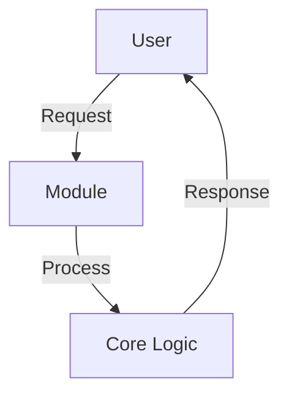

---
# ===== MODULE IDENTITY =====
title: "Voice Conversation - Enable real-time voice conversation with LocalBrain AI assis"
module_id: "localbrain_voice_conversation_147764"
type: "governance"
category: "primitive"

# ===== SYSTEMATIC SCAFFOLDING =====
lifecycle: "dev"
state: "minimal"
seat: "mvp"

# ===== AVAILABILITY AND ACCESS =====
phase_availability: "always"
priority: "medium"
agent_accessible: true
user_configurable: true

# ===== PROMOTION GATES =====
promotion_gates:
  to_intermediate_i1:
    - "Core functionality implemented and tested"
    - "Basic security requirements met"
    - "Documentation complete"
  to_intermediate_i2:
    - "Reliability and UX improvements complete"
    - "Performance benchmarks met"
    - "All 7 features implemented"
  to_intermediate_i3:
    - "Integration breadth achieved"
    - "Advanced capabilities operational"
    - "Comprehensive testing completed"
  to_complete:
    - "Production deployment validated"
    - "All features fully operational"
    - "Performance SLA met (>99.9% uptime)"

# ===== OBSERVABILITY =====
observability:
  metrics:
    - "voice_conversation.operation.success_rate"
    - "voice_conversation.performance.response_time_ms"
    - "voice_conversation.errors.count"
    - "voice_conversation.usage.requests_per_second"
  alerts:
    - "voice_conversation.error_rate_high"
    - "voice_conversation.performance_degraded"
    - "voice_conversation.availability_low"
  dashboards:
    - "voice_conversation_health"
    - "voice_conversation_performance"
    - "voice_conversation_usage"

# ===== SECURITY REQUIREMENTS =====
security:
  authentication_required: true
  authorization_level: "public"
  data_classification: "public"
  encryption_at_rest: true
  encryption_in_transit: true
  audit_logging: true
  rate_limiting: false
  input_validation: "basic"

# ===== TECHNICAL METADATA =====
dependencies: []
integrations: []
api_contracts: []
last_updated: "2025-10-10"
version: "1.0.0"
maintainer: "Orchestra.blue Team"

# ===== AGENTIC INTEGRATION =====
agent_capabilities:
  can_read: true
  can_write: false
  can_propose_changes: true
  requires_approval: true

agent_boundaries:
  allowed_operations: ["read","query","analyze"]
  forbidden_operations: ["delete","unauthorized_access","security_bypass"]
  escalation_triggers: ["security_violation","performance_degradation","data_corruption"]
---

# Voice Conversation - Enable real-time voice conversation with LocalBrain AI assis

## 4-Purpose

**O QUE É:** Enable real-time voice conversation with LocalBrain AI assistant, allowing users to control their computer entirely through voice commands with natural language processing.

**DEVE CONTER:**
- Objetivo em 1-2 parágrafos explicando o "porquê" este módulo existe
- "Out of scope" em bullets (o que este módulo NÃO faz)

**NÃO DEVE CONTER:**
- Decisões de implementação específicas
- Comandos de execução
- Detalhes técnicos (vão em Architecture)

---

## 5-Primary Features

**O QUE É:** Compromissos de capacidade do módulo - o que ele entrega.

**Features:**
- **Real-time Voice Recognition With Sub-second Latency:** Real-time voice recognition with sub-second latency
- **Natural Language Understanding For Complex Commands:** Natural language understanding for complex commands
- **Full System Access (Browser, Files, Applications):** Full system access (browser, files, applications)
- **Multi-language Support (English, Portuguese):** Multi-language support (English, Portuguese)
- **Context-aware Responses Based On Current Workspace:** Context-aware responses based on current workspace
- **Hands-free Operation Mode:** Hands-free operation mode
- **Real-time Voice Conversation With Localbrain Ai Assistant, Allowing Users To Control Their Computer Entirely Through Voice Commands With Natural Language Processing:** real-time voice conversation with LocalBrain AI assistant, allowing users to control their computer entirely through voice commands with natural language processing

---

## 6-Architecture

**O QUE É:** Estrutura INTERNA do módulo e seus fluxos internos.

The voice conversation system consists of three main components:

1. **Voice Input Handler**: Captures audio from microphone using Web Audio API
2. **Speech Recognition Engine**: Converts speech to text using Google Cloud Speech-to-Text
3. **AI Processing Layer**: Processes commands using Claude API with real-time streaming
4. **Action Executor**: Executes system commands based on AI interpretation
5. **Voice Output Generator**: Text-to-speech for AI responses

**Components:**

---

## 7-Contracts

**O QUE É:** Contratos de API e interfaces públicas.

API contracts to be defined.

---

## 8-Dependencies

**O QUE É:** Dependências externas e internas.

**Dependencies:**

---

## 9-Testing

**O QUE É:** Estratégia e requisitos de teste.

**Unit Tests:**
- Test core functionality
- Test error handling
- Test edge cases

**Integration Tests:**
- Test API contracts
- Test dependencies
- Test data flow

**E2E Tests:**
- Test complete user workflows
- Test performance under load
- Test security requirements

---

## 10-Security

**O QUE É:** Requisitos e implementações de segurança.

**Authentication:** Required
**Encryption:** In transit
**Audit Logging:** Enabled
**Data Classification:** public

---

## 11-Performance

**O QUE É:** Requisitos de desempenho e SLAs.

**Response Time:** <500ms (p95)
**Memory Usage:** <200MB
**Concurrent Requests:** 100
**Availability:** 99.9%

---

## 12-Observability

**O QUE É:** Métricas, alertas e dashboards.

Metrics, alerts, and dashboards defined in frontmatter observability section.

**Metrics:**
- `voice_conversation.operation.success_rate`
- `voice_conversation.performance.response_time_ms`
- `voice_conversation.errors.count`
- `voice_conversation.usage.requests_per_second`

**Alerts:**
- `voice_conversation.error_rate_high`
- `voice_conversation.performance_degraded`
- `voice_conversation.availability_low`

**Dashboards:**
- `voice_conversation_health`
- `voice_conversation_performance`
- `voice_conversation_usage`

---

## 13-Operations

**O QUE É:** Deployment, monitoring, e manutenção.

**Deployment:**
- Standard deployment process
- Zero-downtime deployment
- Rollback capability

**Monitoring:**
- Health checks enabled
- Performance monitoring
- Error tracking

**Maintenance:**
- Regular updates
- Security patches
- Performance optimization

---

## 14-Integrations & References

**O QUE É:** Sistemas externos e referências.

No external integrations required.

---

## 15-Promotion Checklist

**O QUE É:** Critérios para avançar entre estados.

### To Intermediate I1:
- [ ] Core functionality implemented and tested
- [ ] Basic security requirements met
- [ ] Documentation complete

### To Intermediate I2:
- [ ] Reliability and UX improvements complete
- [ ] Performance benchmarks met
- [ ] All 7 features implemented

### To Intermediate I3:
- [ ] Integration breadth achieved
- [ ] Advanced capabilities operational
- [ ] Comprehensive testing completed

### To Complete:
- [ ] Production deployment validated
- [ ] All features fully operational
- [ ] Performance SLA met (>99.9% uptime)

---

**🎊 Generated by Central-MCP Automated Spec Generator**
**📅 Generated: 2025-10-10T04:05:47.766Z**
**🤖 Agent: B (Sonnet-4.5)**
