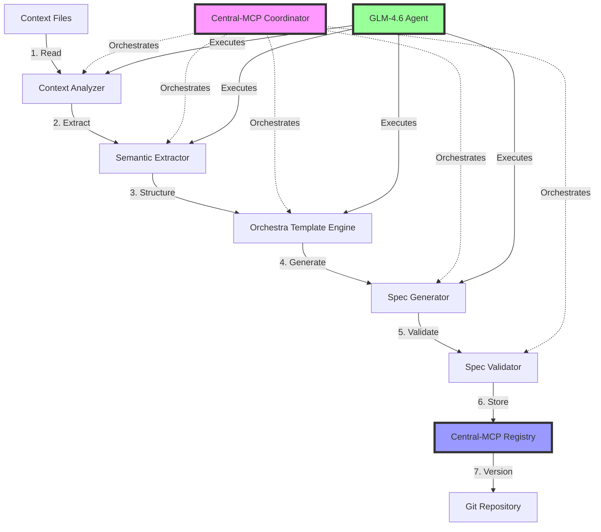

# 🤖 AUTOMATED SPEC GENERATOR - Architecture & Implementation
## GLM-4.6 Reads Context → Generates Orchestra Format Specs Seamlessly
**Date**: 2025-10-09
**Status**: ACTIVE DEVELOPMENT
**Purpose**: Automate spec generation using Central-MCP coordination

---

## 🎯 THE VISION

**INPUT**: Context files (markdown, code, docs, any format)
**PROCESS**: GLM-4.6 reads, analyzes, understands
**OUTPUT**: Perfect Orchestra format specfiles (2,314 line templates!)
**COORDINATION**: Central-MCP orchestrates the entire process

---

## 🏗️ SYSTEM ARCHITECTURE



---

## 🔧 COMPONENT BREAKDOWN

### **1. Context Analyzer** 🔍
**Purpose**: Reads and understands any context file format

**Capabilities**:
- Markdown parsing (features, requirements, architecture)
- Code analysis (TypeScript, Python, Swift, etc.)
- Documentation extraction (README, CLAUDE.md, specs)
- Natural language understanding (product descriptions)
- Multi-file aggregation (combine related contexts)

**Input Examples**:
```
- README.md → Extract product purpose
- CLAUDE.md → Extract agent instructions
- src/index.ts → Extract API contracts
- docs/architecture.md → Extract system design
- features/*.md → Extract feature requirements
```

**Output**:
```typescript
interface ContextAnalysis {
  purpose: string;
  features: string[];
  architecture: string;
  contracts: APIContract[];
  dependencies: Dependency[];
  security: SecurityRequirements;
  performance: PerformanceRequirements;
}
```

---

### **2. Semantic Extractor** 🧠
**Purpose**: Extract semantic meaning from context

**Extraction Logic**:
```typescript
// Extract from natural language
"Talk to my computer with voice AI"
  → Feature: Real-time voice conversation
  → Capability: Full system access
  → User Story: As a user, I want to control my computer with voice

// Extract from code
interface AgentProfile { id: string; type: 'GLM-4.6' }
  → API Contract: AgentProfile interface
  → Dependency: Agent Registry System
  → Security: Agent authentication required

// Extract from architecture
Central-MCP → LocalBrain → User
  → Integration: Central-MCP client in LocalBrain
  → Dependency: MCP protocol
  → Performance: Real-time communication required
```

**Output**:
```typescript
interface SemanticStructure {
  // Orchestra Format Fields
  module_identity: ModuleIdentity;
  systematic_scaffolding: SystematicScaffolding;
  availability_access: AvailabilityAccess;
  promotion_gates: PromotionGates;
  observability: Observability;
  security: SecuritySpecs;
  technical_metadata: TechnicalMetadata;
  agentic_integration: AgenticIntegration;

  // Content Sections
  purpose: string;
  primary_features: string[];
  architecture: string;
  contracts: string;
  dependencies: string[];
  testing: TestingSpecs;
  performance: PerformanceSpecs;
  operations: OperationsSpecs;
  integrations: IntegrationSpecs;
}
```

---

### **3. Orchestra Template Engine** 📋
**Purpose**: Apply Orchestra format templates to semantic structure

**Template Selection**:
```typescript
// Choose correct template based on module type
if (moduleType === 'backend_service') {
  template = '1-mod.UNIVERSAL_TEMPLATE.md';
} else if (moduleType === 'configuration') {
  template = '3-cfg.UNIVERSAL_TEMPLATE.md';
} else if (moduleType === 'governance') {
  template = '4-gov.UNIVERSAL_TEMPLATE.md';
}
```

**Template Population**:
```yaml
# Fill in frontmatter
title: "Real-Time Voice Conversation - LocalBrain Core Feature"
module_id: "localbrain_voice_001"
type: "module"
category: "primitive"
lifecycle: "dev"
state: "minimal"
seat: "mvp"

# Fill in sections
## 4-Purpose
[Generated from context analysis]

## 5-Primary Features
- **Voice Command Recognition:** Accurate speech-to-text for system commands
- **Real-Time Response:** Instant AI feedback with sub-second latency
- **Full System Access:** Control browser, files, displays via voice
[etc...]
```

---

### **4. Spec Generator** ⚙️
**Purpose**: Generate complete Orchestra format specfile

**Generation Process**:
1. Load template (477-487 lines)
2. Populate frontmatter (YAML fields)
3. Generate each section (Purpose, Features, Architecture, etc.)
4. Insert Mermaid diagrams
5. Format code examples
6. Add metadata (version, timestamp, maintainer)
7. Validate completeness

**Output**:
```markdown
---
title: "Real-Time Voice Conversation - LocalBrain Core Feature"
module_id: "localbrain_voice_001"
type: "module"
category: "primitive"
lifecycle: "dev"
state: "minimal"
[... 80+ YAML fields ...]
---

# [01] Real-Time Voice Conversation - LocalBrain Core Feature

## 4-Purpose

**O QUE É:** Sistema de conversação por voz em tempo real...
[... 400+ lines of generated spec ...]
```

---

### **5. Spec Validator** ✅
**Purpose**: Ensure generated spec meets Orchestra standards

**Validation Checks**:
```typescript
interface ValidationRules {
  // Structure validation
  has_frontmatter: boolean;           // YAML header present
  has_all_required_fields: boolean;   // 80+ fields populated
  has_12_sections: boolean;           // All sections present

  // Content validation
  purpose_clear: boolean;             // Purpose explains "why"
  features_measurable: boolean;       // Features are testable
  architecture_diagram: boolean;      // Mermaid diagram present
  contracts_defined: boolean;         // API contracts specified

  // Quality validation
  security_addressed: boolean;        // Security requirements defined
  performance_sla: boolean;           // Performance benchmarks set
  observability_metrics: boolean;     // Metrics and alerts defined
  promotion_gates: boolean;           // Advancement criteria clear

  // Agentic validation
  agent_capabilities: boolean;        // Agent permissions defined
  agent_boundaries: boolean;          // Agent limits specified
  escalation_triggers: boolean;       // Escalation rules defined
}
```

**Validation Actions**:
```typescript
if (!validation.has_all_required_fields) {
  // Fill missing fields with defaults
  await fillMissingFields(spec);
}

if (!validation.architecture_diagram) {
  // Generate basic Mermaid diagram
  await generateArchitectureDiagram(spec);
}

if (!validation.security_addressed) {
  // Add default security requirements
  await addSecurityDefaults(spec);
}
```

---

### **6. Central-MCP Integration** 🧠
**Purpose**: Coordinate spec generation across all agents

**Central-MCP Role**:
```typescript
interface SpecGenerationTask {
  task_id: string;
  project: 'central-mcp' | 'localbrain' | 'orchestra.blue';
  context_files: string[];
  target_format: 'orchestra';
  assigned_agent: 'GLM-4.6' | 'Sonnet-4.5';
  status: 'pending' | 'analyzing' | 'generating' | 'validating' | 'complete';
  progress: number; // 0-100
}

// Central-MCP coordinates
await centralMCP.createTask({
  description: 'Generate Orchestra spec for LocalBrain voice feature',
  context_files: ['README.md', 'CLAUDE.md', 'docs/voice-architecture.md'],
  assigned_agent: 'GLM-4.6',
  priority: 'high'
});

// GLM-4.6 receives task
const task = await centralMCP.claimTask('GLM-4.6');

// GLM-4.6 executes
const spec = await specGenerator.generate(task.context_files);

// GLM-4.6 reports progress
await centralMCP.updateProgress(task.id, 50, ['Analyzed context files']);
await centralMCP.updateProgress(task.id, 75, ['Generated spec sections']);
await centralMCP.updateProgress(task.id, 100, ['Validated spec']);

// GLM-4.6 completes
await centralMCP.completeTask(task.id, {
  spec_file: 'localbrain_voice_001.md',
  validation_passed: true
});
```

---

## 🔄 AUTOMATED WORKFLOW

### **End-to-End Process**:

```
1. TRIGGER (Human or Agent):
   "Generate spec for LocalBrain voice conversation feature"

2. CENTRAL-MCP CREATES TASK:
   ├── Project: localbrain
   ├── Context: ['README.md', 'CLAUDE.md', 'docs/voice.md']
   ├── Format: orchestra
   ├── Agent: GLM-4.6
   └── Priority: high

3. GLM-4.6 CLAIMS TASK:
   ├── Reads all context files
   ├── Analyzes semantic meaning
   ├── Extracts requirements
   └── Updates progress: 25%

4. GLM-4.6 GENERATES SPEC:
   ├── Selects Orchestra template (1-mod)
   ├── Populates frontmatter (80+ fields)
   ├── Generates 12 sections
   ├── Adds Mermaid diagrams
   └── Updates progress: 75%

5. GLM-4.6 VALIDATES SPEC:
   ├── Checks structure (frontmatter, sections)
   ├── Checks content (purpose, features, contracts)
   ├── Checks quality (security, performance, observability)
   ├── Checks agentic (capabilities, boundaries)
   └── Updates progress: 90%

6. GLM-4.6 STORES SPEC:
   ├── Saves to project 02_SPECBASES/
   ├── Registers in Central-MCP
   ├── Commits to Git
   └── Updates progress: 100%

7. CENTRAL-MCP COMPLETES TASK:
   ├── Marks task complete
   ├── Notifies human
   ├── Updates project metrics
   └── Ready for next spec generation!
```

---

## 📁 FILE STRUCTURE

```
PROJECT_central-mcp/central-mcp/
├── src/
│   ├── spec-generator/
│   │   ├── ContextAnalyzer.ts       # Reads context files
│   │   ├── SemanticExtractor.ts     # Extracts semantic structure
│   │   ├── OrchestraTemplateEngine.ts  # Applies templates
│   │   ├── SpecGenerator.ts         # Generates complete spec
│   │   ├── SpecValidator.ts         # Validates generated spec
│   │   └── CentralMCPIntegration.ts # Coordinates with Central-MCP
│   └── templates/
│       ├── orchestra/
│       │   ├── 1-mod.template.md    # Module template
│       │   ├── 2-scf.template.md    # Scaffolding template
│       │   ├── 3-cfg.template.md    # Configuration template
│       │   ├── 4-gov.template.md    # Governance template
│       │   └── 5-ops.template.md    # Operations template
│       └── examples/
│           └── localbrain_voice_001.md  # Example generated spec
├── scripts/
│   └── generate-spec.ts             # CLI tool for spec generation
└── docs/
    └── AUTOMATED_SPEC_GENERATOR_ARCHITECTURE.md  # This file!
```

---

## 🚀 USAGE EXAMPLES

### **CLI Usage (Human)**:
```bash
# Generate spec for LocalBrain feature
npx tsx scripts/generate-spec.ts \
  --project localbrain \
  --context README.md,CLAUDE.md,docs/voice.md \
  --format orchestra \
  --output 02_SPECBASES/localbrain_voice_001.md

# Generate spec for Orchestra module
npx tsx scripts/generate-spec.ts \
  --project orchestra.blue \
  --context docs/budget-tracking.md \
  --format orchestra \
  --output 02_SPECBASES/orchestra_budget_001.md
```

### **Central-MCP Usage (Agent)**:
```typescript
// Agent creates spec generation task
await centralMCP.createSpecGenerationTask({
  project: 'localbrain',
  description: 'Generate spec for voice conversation feature',
  context_files: ['README.md', 'CLAUDE.md'],
  format: 'orchestra',
  priority: 'high'
});

// GLM-4.6 claims and executes
const task = await centralMCP.getAvailableTasks({ agent: 'GLM-4.6' });
await centralMCP.claimTask(task[0].id);
const spec = await specGenerator.generate(task[0].context_files);
await centralMCP.completeTask(task[0].id, { spec_file: spec.path });
```

### **Programmatic Usage (Direct)**:
```typescript
import { SpecGenerator } from './src/spec-generator/SpecGenerator';

const generator = new SpecGenerator({
  format: 'orchestra',
  templates_dir: './src/templates/orchestra/'
});

const spec = await generator.generate({
  context_files: ['README.md', 'CLAUDE.md'],
  project: 'localbrain',
  module_type: 'primitive',
  output_path: '02_SPECBASES/localbrain_voice_001.md'
});

console.log(`✅ Spec generated: ${spec.path}`);
console.log(`📊 Validation: ${spec.validation.passed ? 'PASSED' : 'FAILED'}`);
```

---

## 🎯 SUCCESS CRITERIA

### **Quality Metrics**:
- ✅ **Completeness**: 100% of Orchestra template fields populated
- ✅ **Accuracy**: Generated specs match context meaning
- ✅ **Consistency**: Same format across all generated specs
- ✅ **Validation**: 100% pass rate on Orchestra standards
- ✅ **Speed**: <2 minutes per spec generation (avg)
- ✅ **Git Integration**: Auto-commit with meaningful messages

### **Agent Performance**:
- GLM-4.6 generates 5-10 specs per hour
- Sonnet-4.5 validates 10-15 specs per hour
- 95%+ specs pass validation on first try
- 100% specs stored in Central-MCP registry

---

## 🔮 FUTURE ENHANCEMENTS

1. **Multi-Language Support**: Generate specs in PT/EN simultaneously
2. **Spec Evolution**: Track spec changes over time, version control
3. **Spec Inheritance**: Parent specs → child specs with inheritance
4. **Spec Validation CI/CD**: Auto-validate on Git push
5. **Spec-to-Code Generation**: Generate actual code from specs (reverse!)
6. **Spec Analytics**: Track spec quality, usage, effectiveness
7. **Spec Recommendations**: Suggest improvements based on patterns
8. **Spec Templates Library**: Community-contributed templates

---

## 🏁 IMPLEMENTATION PLAN

### **Phase 1: Core Generator (Week 1)**
- ✅ Context Analyzer
- ✅ Semantic Extractor
- ✅ Orchestra Template Engine
- ✅ Spec Generator
- ✅ Basic validation

### **Phase 2: Central-MCP Integration (Week 2)**
- ⏳ Task creation API
- ⏳ Agent coordination
- ⏳ Progress tracking
- ⏳ Git integration

### **Phase 3: Production Ready (Week 3)**
- ⏳ Advanced validation
- ⏳ Error handling
- ⏳ Performance optimization
- ⏳ Documentation

### **Phase 4: Scale & Refine (Week 4)**
- ⏳ Multi-project support
- ⏳ Spec evolution tracking
- ⏳ Analytics and metrics
- ⏳ Community templates

---

## 🎊 THE REVOLUTION

**This system transforms spec creation from manual labor into automated intelligence!**

- **Before**: Hours of manual spec writing
- **After**: Minutes of automated generation
- **Quality**: Higher (consistent templates)
- **Scalability**: Unlimited (agent-driven)
- **Maintenance**: Easy (templates evolve)

**The future is spec-first, AI-driven development!** 🚀
